# Elata Protocol

**On‑chain economics for the Internet of Brains.**

This repository contains the smart contracts that power Elata's token, staking, XP (reputation), and experiment‑funding governance. It is the **economic coordination layer** that aligns players, researchers, developers, and long‑term token holders in building the future of precision psychiatry.

> **Scope of this repo**: Token economics + staking + XP + funding governance. (ZORP experiment data contracts live in a separate repository.)

---

## 💡 What problem does the protocol solve?

```mermaid
graph LR
    subgraph "Traditional Research"
        T1[Slow Funding<br/>🐌 Months/years]
        T2[Centralized Decisions<br/>🏢 Committee-based]
        T3[Disconnected Incentives<br/>❌ No user alignment]
    end
    
    subgraph "Elata Solution"
        S1[Weekly Funding<br/>⚡ Community-driven]
        S2[Decentralized Voting<br/>🗳️ XP-weighted]
        S3[Aligned Incentives<br/>✅ Usage-based rewards]
    end
    
    T1 -.->|Replaces| S1
    T2 -.->|Replaces| S2
    T3 -.->|Replaces| S3
    
    style T1 fill:#ffcdd2
    style T2 fill:#ffcdd2
    style T3 fill:#ffcdd2
    style S1 fill:#c8e6c9
    style S2 fill:#c8e6c9
    style S3 fill:#c8e6c9
```



Neurotech needs participation at scale—people playing EEG games, training, submitting sessions—and a way to **fund the right experiments** while **accruing value** to long‑term stewards. Traditional research funding is slow, centralized, and disconnected from actual usage.

Elata Protocol provides:

* **A governance token ($ELTA)** with real utility and future on‑chain voting support
* **Time‑locked staking (veELTA)** that weights governance toward long‑horizon holders
* **Non‑transferable XP tokens** that turn participation into *voice* (not money)
* **XP‑weighted funding pools (LotPool)** that direct budgets to the most valuable experiments and apps

Think of it as an **app & research economy** where usage and participation determine what gets built next, and protocol value flows to committed ELTA holders.

---

## 🔁 Economic flywheel

```mermaid
graph TD
    A[Users Play EEG Apps<br/>🎮 Engagement] --> B[Generate Data & Usage<br/>📊 Value Creation]
    B --> C[Protocol Captures Fees<br/>💰 Revenue Generation]
    C --> D[Community Directs Funding<br/>🗳️ XP-weighted Voting]
    D --> E[Fund Research & Development<br/>🔬 Innovation]
    E --> F[Better Apps & Experiences<br/>⭐ Quality Improvement]
    F --> A
    
    C --> G[Distribute Yields to Stakers<br/>💎 Real Returns]
    G --> H[Attract Long-term Holders<br/>🤝 Stable Governance]
    H --> I[Quality Governance Decisions<br/>🏛️ Protocol Evolution]
    I --> D
    
    style A fill:#e1f5fe
    style C fill:#fff3e0
    style D fill:#f3e5f5
    style G fill:#e8f5e8
```



**Play → Data → Fees → Funding → Yield → Better Apps → More Play**

1. **Users engage**: Play EEG apps, submit data sessions, participate in tournaments
2. **Protocol captures value**: App store fees, tournament rake, infrastructure usage
3. **Community directs funding**: Weekly LotPool allocates budgets via XP voting
4. **Value flows to stakers**: Protocol revenues distributed to veELTA holders (real yield)
5. **Ecosystem grows**: Funded experiments + dev grants → better apps → more engagement

**Key insight**: XP guides *what to fund*; ELTA staking captures *the economics*.

---

## 🧱 Contract architecture

```mermaid
graph TB
    subgraph "Core Protocol"
        ELTA[ELTA Token<br/>🪙 Governance & Utility<br/>77M Supply Cap]
        VE[VeELTA<br/>🔒 Multi-position Staking<br/>NFT-based, 1w-4y locks]
        XP[ElataXP<br/>🏅 Experience Points<br/>14-day decay, soulbound]
        LP[LotPool<br/>💧 Funding Rounds<br/>XP-weighted voting]
    end
    
    subgraph "Advanced Features"
        RD[RewardsDistributor<br/>🎁 Staker Rewards<br/>Merkle tree, 7d epochs]
        GOV[ElataGovernor<br/>🏛️ Onchain Governance<br/>4% quorum, 1d delay]
        TL[ElataTimelock<br/>⏰ Execution Delays<br/>48h standard, 6h emergency]
        STATS[ProtocolStats<br/>📊 Frontend Utils<br/>Batch queries]
    end
    
    ELTA --> VE
    ELTA --> GOV
    VE --> RD
    XP --> LP
    GOV --> TL
    
    STATS -.-> ELTA
    STATS -.-> VE
    STATS -.-> XP
    STATS -.-> LP
    
    style ELTA fill:#ff9999
    style VE fill:#99ccff
    style XP fill:#99ff99
    style LP fill:#ffcc99
    style RD fill:#cc99ff
    style GOV fill:#ffccff
```



### Core Protocol (Phase 1)

| Contract | Purpose | Key Features |
|----------|---------|--------------|
| **[ELTA.sol](src/token/ELTA.sol)** | Governance & utility token | ERC20 + Votes + Permit + Burnable, 77M cap, no fees |
| **[VeELTA.sol](src/staking/VeELTA.sol)** | Vote-escrowed staking | Linear decay, 1 week–2 year locks, one position per user |
| **[ElataXP.sol](src/xp/ElataXP.sol)** | Basic experience points | Non-transferable, checkpoint tracking, governance ready |
| **[LotPool.sol](src/governance/LotPool.sol)** | Research funding rounds | XP-weighted voting, weekly cycles, transparent payouts |

### Advanced Features (Phase 2)

| Contract | Purpose | Key Features |
|----------|---------|--------------|
| **[VeELTAMultiLock.sol](src/staking/VeELTAMultiLock.sol)** | Advanced staking | NFT positions, multiple locks, merge/split, 4-year max |
| **[ElataXPWithDecay.sol](src/xp/ElataXPWithDecay.sol)** | XP with decay | 14-day rolling decay, keeper functions, anti-hoarding |
| **[RewardsDistributor.sol](src/rewards/RewardsDistributor.sol)** | Staker rewards | Merkle tree distribution, multiple tokens, epoch-based |
| **[ElataGovernorSimple.sol](src/governance/ElataGovernorSimple.sol)** | Onchain governance | 4% quorum, emergency proposals, timelock integration |

### Why each contract exists

* **ELTA**: Clean, DEX-compatible governance token with **no transfer taxes** and **hard supply cap**
* **VeELTA**: Aligns governance with **time commitment**; prevents flash-loan governance attacks
* **XP**: Rewards **participation over capital**; non-transferable prevents reputation markets
* **LotPool**: Turns community activity into **transparent capital allocation**
* **Multi-Lock**: Advanced users can optimize positions, merge/split for flexibility
* **XP Decay**: Encourages **continuous participation**, prevents long-term hoarding
* **Rewards**: Distributes **real yield** to stakers based on protocol revenue
* **Governor**: Enables **on-chain voting** for protocol parameters and upgrades

### App Launch Framework (Phase 3)

```mermaid
graph TD
    subgraph "App Token Launch"
        AF[AppFactory<br/>🏭 Permissionless Launcher]
        ABC[AppBondingCurve<br/>📈 Fair Price Discovery]
        AT[AppToken<br/>🪙 Individual App Tokens]
        LL[LpLocker<br/>🔒 Liquidity Protection]
    end
    
    subgraph "Launch Process"
        CREATE[Developer Creates App<br/>💡 Stakes 100 ELTA]
        CURVE[Bonding Curve Sale<br/>📊 Price increases with demand]
        GRADUATE[Auto-Graduation<br/>🎓 At 42k ELTA raised]
        LIQUIDITY[DEX Liquidity<br/>💧 Locked for 2 years]
    end
    
    AF --> CREATE
    CREATE --> CURVE
    CURVE --> GRADUATE
    GRADUATE --> LIQUIDITY
    
    ABC -.-> CURVE
    AT -.-> CURVE
    LL -.-> LIQUIDITY
    
    style AF fill:#e8f5e8
    style ABC fill:#fff3e0
    style AT fill:#e3f2fd
    style LL fill:#ffebee
```



**New App Launch Contracts:**

| Contract | Purpose | Key Features |
|----------|---------|--------------|
| **[AppFactory.sol](src/apps/AppFactory.sol)** | App token launcher | Permissionless creation, bonding curves, registry |
| **[AppBondingCurve.sol](src/apps/AppBondingCurve.sol)** | Fair price discovery | Constant product formula, auto-liquidity, LP locking |
| **[AppToken.sol](src/apps/AppToken.sol)** | Individual app tokens | Standard ERC20, no fees, fixed supply, metadata |
| **[LpLocker.sol](src/apps/LpLocker.sol)** | Liquidity protection | Time-locked LP tokens, rug-pull prevention |

**Why the App Launch Framework:**
* **Developer Empowerment**: Any developer can launch their EEG app with its own token economy
* **Fair Distribution**: Bonding curves ensure fair price discovery without insider allocations
* **Ecosystem Growth**: Each app token creates new utility and demand for ELTA
* **Liquidity Security**: Automatic LP creation and locking prevents rug pulls
* **Protocol Integration**: App launches feed back into ELTA treasury and governance

### App Launch Process


## 🪙 Token economics deep dive

### ELTA Token Mechanics

```solidity
// Core parameters (from ELTA.sol)
MAX_SUPPLY = 77,000,000 ELTA  // Hard cap, immutable
decimals = 18                 // Standard precision
MINTER_ROLE                   // Role-gated minting up to cap
```

**Supply & Distribution**
- **Total Supply**: 77,000,000 ELTA (hard cap)
- **Initial Mint**: ~10,000,000 ELTA to treasury
- **Remaining**: 67,000,000 ELTA available for future minting (role-gated)

**Key Properties**
- ✅ **No transfer fees** → DEX/aggregator compatible
- ✅ **ERC20Votes** → Onchain governance ready
- ✅ **ERC20Permit** → Gasless approvals
- ✅ **Burnable** → Deflationary pressure
- ✅ **Non-upgradeable** → Immutable, trustless

### Value Accrual Mechanisms

**Revenue Sources** (examples)
```
App Store (15% take rate) + Tournament Rake (5-10%) + Infrastructure Fees
```

**Distribution Policy** (illustrative)
```
Protocol Revenue
├── 50% → Treasury (grants, operations, runway)
├── 25% → veELTA Yield (real yield to stakers)
└── 25% → Buyback & Burn (deflationary pressure)
```

**Example Calculation**
```
Monthly app volume: $100,000
Store take rate: 15%
Protocol revenue: $15,000

Treasury: $7,500
veELTA yield: $3,750 (distributed to stakers)
Buyback & burn: $3,750 (reduces supply)
```

> **Important**: Data licensing proceeds go to participants via data trusts, **not** to the protocol. ELTA accrues from software/infrastructure economics.

### App Launch Economics

**App Token Launch Model:**
```
Developer Investment: 110 ELTA (100 seed + 10 fee)
├── Seed Liquidity: 100 ELTA → Bonding curve initial liquidity
├── Creation Fee: 10 ELTA → Protocol treasury
└── Token Supply: 1B tokens → Fair distribution via curve

User Purchases: ELTA → App Tokens
├── Protocol Fee: 2.5% → Treasury (sustainable revenue)
├── Net Purchase: 97.5% → Bonding curve reserves
└── Graduation: At 42k ELTA → Auto-create locked DEX liquidity
```

**Economic Benefits:**
- **ELTA Demand**: Every app launch requires ELTA for creation and purchases
- **Protocol Revenue**: 2.5% fee on all app token trading volume
- **Ecosystem Growth**: More apps = more ELTA utility and value
- **Developer Incentives**: Fair token distribution attracts quality developers

---

## 🔒 veELTA Staking — Time-weighted governance

### Voting Power Visualization

```mermaid
graph LR
    subgraph "Voting Power Calculation"
        INPUT[Locked Amount × Time Remaining<br/>÷ MAX_LOCK]
        DECAY[Linear Decay Over Time<br/>📉 Continuous Reduction]
        OUTPUT[Current Voting Power<br/>⚡ Governance Influence]
    end
    
    INPUT --> DECAY --> OUTPUT
    
    style INPUT fill:#e3f2fd
    style DECAY fill:#fff3e0
    style OUTPUT fill:#e8f5e8
```



### Mathematical Formula

```solidity
// From VeELTA.sol line 119
votingPower = (lockedAmount * timeRemaining) / MAX_LOCK

// Constants
MIN_LOCK = 1 weeks    // 604,800 seconds
MAX_LOCK = 208 weeks  // 4 years = 125,798,400 seconds
```

### Examples (MAX_LOCK = 104 weeks)

| Lock Amount | Lock Duration | Initial Voting Power | After 50% Time | At Expiry |
|-------------|---------------|---------------------|-----------------|-----------|
| 1,000 ELTA | 104 weeks | 1,000 veELTA | 500 veELTA | 0 veELTA |
| 1,000 ELTA | 52 weeks | 500 veELTA | 250 veELTA | 0 veELTA |
| 1,000 ELTA | 26 weeks | 250 veELTA | 125 veELTA | 0 veELTA |

### Advanced Multi-Lock System

```solidity
// From VeELTAMultiLock.sol
MAX_LOCK = 208 weeks  // 4 years for advanced system
EMERGENCY_UNLOCK_PENALTY = 50%  // Discourages abuse
```

**Features**:
- **Multiple concurrent positions** per user (NFT-based)
- **Position management**: merge, split, delegate independently
- **Emergency unlock** with 50% penalty (admin-controlled)
- **Extended lock periods** up to 4 years for maximum commitment


## 🏅 ElataXP — Participation without speculation

### Basic XP System

**What it is**: Non-transferable ERC20-style points token (soulbound)

**How it's earned** (policy examples):
- **EEG data submission**: 10-100 XP per valid session
- **App engagement**: 1-10 XP per activity/achievement
- **Tournament participation**: Bonus XP for performance
- **Community governance**: XP for proposal creation/voting

**How it's used**:
- **LotPool voting** (funding experiments) via block-based snapshots
- **App store boosts** (minimum XP for premium features)
- **Reputation system** (proof of sustained contribution)
- **Access control** (XP-gated tournaments, exclusive content)

### Advanced XP with Decay

```solidity
// From ElataXPWithDecay.sol
DECAY_WINDOW = 14 days        // Rolling decay period
MIN_DECAY_INTERVAL = 1 hours  // Rate limiting for updates

// Decay formula (linear)
effectiveXP = sum(entryAmount × (DECAY_WINDOW - age) / DECAY_WINDOW)
```

**Decay Mechanism**:
1. Each XP award creates a **timestamped entry**
2. XP decays **linearly over 14 days** from award date
3. **Keeper functions** can batch-update decay for gas efficiency
4. **Automatic decay** applied when new XP is awarded

**Example Decay Timeline**:
```
Day 0:  Award 1000 XP → Effective: 1000 XP (100%)
Day 7:  Effective: 500 XP (50%)
Day 14: Effective: 0 XP (fully decayed)
```

**Why decay?** Encourages **continuous participation** and prevents long-term XP hoarding that could skew governance.

### XP Decay Visualization

```mermaid
graph TD
    subgraph "XP Lifecycle"
        AWARD[XP Awarded<br/>📅 Timestamped Entry]
        FRESH[Day 0: 100% Effective<br/>✅ Full Voting Power]
        DECAY[Day 7: 50% Effective<br/>⚠️ Decay Warning]
        EXPIRED[Day 14: 0% Effective<br/>❌ No Voting Power]
        UPDATE[Decay Update<br/>🔄 Burn Expired XP]
    end
    
    AWARD --> FRESH
    FRESH --> DECAY
    DECAY --> EXPIRED
    EXPIRED --> UPDATE
    
    style FRESH fill:#4caf50
    style DECAY fill:#ffc107
    style EXPIRED fill:#f44336
    style UPDATE fill:#2196f3
```



---

## 💧 LotPool — XP-weighted funding rounds

### Mechanism

```solidity
// From LotPool.sol - Weekly funding cycles
function startRound(
    bytes32[] calldata options,     // e.g., ["EXP-123", "APP-456"]
    address[] calldata recipients,  // Payout addresses
    uint64 durationSecs            // Typically 7 days
) external returns (uint256 roundId, uint256 snapshotBlock)
```

**Round Lifecycle**:
1. **Start**: Admin creates round with proposals and recipients
2. **Snapshot**: Contract captures XP balances at specific block
3. **Voting**: Users allocate their snapshot XP across options
4. **Finalization**: Admin distributes ELTA to winning proposal

### Voting Formula

```solidity
// Users can allocate up to their XP balance across options
voterXP = XP.getPastXP(msg.sender, snapshotBlock);
totalAllocated = sum(voteWeights);  // Must not exceed voterXP

// Winner determination
winner = option with max(totalVotes)
```

**Example Round**:
```
Round 1: "PTSD Research" vs "Depression Study"
- Alice (2000 XP): votes 1500 for PTSD, 500 for Depression
- Bob (1000 XP): votes 800 for Depression
- Charlie (500 XP): votes 500 for PTSD

Results:
- PTSD Research: 2000 votes (1500 + 500)
- Depression Study: 1300 votes (500 + 800)
- Winner: PTSD Research → receives funding
```

**Properties**:
- ✅ **Sybil-resistant** via XP (must be earned on-chain)
- ✅ **Transparent** (all votes and payouts on-chain)
- ✅ **Modular** (recipients can be PIs, escrow contracts, dev grants)
- ✅ **Snapshot-based** (prevents double-voting or manipulation)

### Funding Round Flow


## 🧮 Technical specifications

### Contract Constants

```solidity
// Token Economics
ELTA.MAX_SUPPLY = 77,000,000 * 1e18    // Hard cap
ELTA.decimals = 18                     // Standard precision

// Staking Parameters
VeELTA.MIN_LOCK = 1 weeks              // Minimum lock duration
VeELTA.MAX_LOCK = 104 weeks            // 2 years maximum
VeELTAMultiLock.MAX_LOCK = 208 weeks   // 4 years for advanced system
VeELTAMultiLock.EMERGENCY_PENALTY = 50% // Early unlock penalty

// XP Decay System
ElataXPWithDecay.DECAY_WINDOW = 14 days      // Rolling decay period
ElataXPWithDecay.MIN_DECAY_INTERVAL = 1 hours // Rate limiting

// Governance
Governor.votingDelay = 1 days          // Proposal delay
Governor.votingPeriod = 7 days         // Voting duration
Governor.proposalThreshold = 0.1%      // 77K ELTA minimum
Governor.quorum = 4%                   // 3.08M ELTA required

// Rewards
RewardsDistributor.EPOCH_DURATION = 7 days   // Weekly cycles
```

### Gas Costs (Optimized for Mainnet)

```mermaid
graph TD
    subgraph "Low Cost Operations (<100K gas)"
        LC1[ELTA Transfer: 56K<br/>💰 Standard token transfer]
        LC2[ELTA Mint: 67K<br/>🏭 With supply cap check]
        LC3[VeELTA Lock: 88K<br/>🔒 Position creation]
        LC4[XP Decay Update: 87K<br/>🔄 Single user update]
        LC5[LotPool Vote: 86K<br/>🗳️ XP allocation]
        LC6[Reward Claim: 80K<br/>🎁 Merkle verification]
    end
    
    subgraph "Medium Cost Operations (100K-300K gas)"
        MC1[XP Award: 189K<br/>🏅 With auto-delegation]
        MC2[Multi-lock Create: 256K<br/>🎯 NFT + delegation]
    end
    
    style LC1 fill:#c8e6c9
    style LC2 fill:#c8e6c9
    style LC3 fill:#c8e6c9
    style LC4 fill:#c8e6c9
    style LC5 fill:#c8e6c9
    style LC6 fill:#c8e6c9
    style MC1 fill:#fff3e0
    style MC2 fill:#fff3e0
```



| Operation | Gas Cost | Notes |
|-----------|----------|-------|
| **ELTA transfer** | ~56K | Standard ERC20 |
| **ELTA mint** | ~67K | With supply cap check |
| **VeELTA lock** | ~88K | Single position creation |
| **Multi-lock create** | ~256K | NFT + delegation setup |
| **XP award** | ~189K | With auto-delegation |
| **XP decay update** | ~87K | Single user update |
| **LotPool vote** | ~86K | XP allocation |
| **Governance vote** | ~90K | Standard governor |
| **Reward claim** | ~80K | Merkle proof verification |

### Deployment Costs

| Contract | Size | Deploy Cost | Status |
|----------|------|-------------|--------|
| ELTA | 13.3KB | 2.3M gas | ✅ Optimal |
| VeELTA | 4.7KB | 1.0M gas | ✅ Optimal |
| ElataXP | 10.8KB | 2.2M gas | ✅ Optimal |
| LotPool | 5.5KB | 1.1M gas | ✅ Optimal |
| VeELTAMultiLock | 13.8KB | 3.0M gas | ✅ Acceptable |
| ElataXPWithDecay | 13.5KB | 2.8M gas | ✅ Acceptable |
| RewardsDistributor | 7.4KB | 1.1M gas | ✅ Optimal |
| ElataGovernor | 16.6KB | 3.2M gas | ✅ Acceptable |

---

## 🔧 Developer integration

### Awarding XP Automatically

```solidity
// Grant XP_MINTER_ROLE to your app contract
xp.grantRole(XP_MINTER_ROLE, address(myAppContract));

// In your app logic
function completeSession(address user, uint256 sessionQuality) external {
    uint256 xpAmount = calculateXP(sessionQuality); // Your logic
    xp.award(user, xpAmount);
}
```

### Creating Staking Positions

```solidity
// Simple staking (one position per user)
veELTA.createLock(1000e18, 52 weeks);
veELTA.increaseAmount(500e18);           // Add more ELTA
veELTA.increaseUnlockTime(newEndTime);   // Extend duration

// Advanced multi-lock
uint256 tokenId = veELTAMulti.createLock(1000e18, 52 weeks);
veELTAMulti.delegatePosition(tokenId, delegateAddress);
```

### Running Funding Rounds

```solidity
// Start weekly funding round
bytes32[] memory options = [keccak256("EXP-123"), keccak256("APP-456")];
address[] memory recipients = [researcher1, developer1];
uint256 roundId = lotPool.startRound(options, recipients, 7 days);

// Users vote with their XP
lotPool.vote(roundId, keccak256("EXP-123"), 500e18);

// Finalize and distribute
lotPool.finalize(roundId, keccak256("EXP-123"), 10000e18);
```


## 🛡️ Security & design principles

### Core Security Features

- **Non-upgradeable contracts** → Immutable logic, no proxy risks
- **Role-based access control** → Multisig-gated admin functions
- **Reentrancy protection** → All state-changing functions protected
- **Supply cap enforcement** → Hard limit prevents inflation attacks
- **Time-locked governance** → Delays prevent immediate execution
- **Merkle proof verification** → Prevents reward manipulation

### Economic Security

- **Linear decay prevents gaming** → No cliff-based manipulation
- **XP non-transferability** → Prevents reputation markets
- **Emergency unlock penalties** → 50% penalty discourages abuse
- **Snapshot-based voting** → Prevents double-voting attacks
- **Minimum lock periods** → Prevents flash-loan governance

---

## 🧪 Build, test, deploy

### Prerequisites

- [Foundry](https://book.getfoundry.sh/) - Ethereum development toolkit
- [Git](https://git-scm.com/) - Version control

### Quick Start

```bash
# Clone and setup
git clone https://github.com/Elata-Biosciences/elata-protocol
cd elata-protocol
forge install
forge build

# Run comprehensive test suite (112 tests, 100% pass rate)
forge test --gas-report

# Deploy to testnet
export ADMIN_MSIG=0xYourGnosisSafe
export INITIAL_TREASURY=0xYourTreasury
forge script script/Deploy.s.sol --rpc-url $SEPOLIA_RPC_URL --broadcast --verify
```

### Test Coverage

**100 comprehensive tests** with 100% pass rate for core contracts:


- **Unit tests**: Individual contract functionality
- **Integration tests**: Cross-contract workflows
- **Fuzz tests**: Property-based testing with random inputs
- **Security tests**: Critical protection verification
- **Gas optimization**: Benchmarked for mainnet efficiency

```bash
# Test specific contracts
forge test --match-contract ELTATest
forge test --match-contract VeELTATest
forge test --match-contract LotPoolTest

# Test with detailed output
forge test -vvv
```

---

## ❓ FAQ (for tokenomics-minded readers)

**Q: Why no "reward token" or emissions?**
A: Emissions tokens tend to inflate and collapse without strong sinks. Elata routes **real protocol fees** to veELTA stakers and uses **buyback & burn**—value tracks actual usage.

**Q: Why separate XP from ELTA?**
A: XP is for *voice & access*; ELTA is for *ownership & yield*. Non-transferable XP prevents buying reputation and incentivizes ongoing contribution over capital.

**Q: Can ELTA be minted after deployment?**
A: Only up to the hard cap (77M) and only by addresses with `MINTER_ROLE`. The DAO can retire the minter role for a fixed supply, or reserve it for future programs.

**Q: What prevents governance attacks?**
A: **Time-locked staking** (can't flash-loan veELTA), **XP requirements** (can't buy reputation), **quorum thresholds** (4% minimum), and **time delays** (48h for execution).

**Q: Why 14-day XP decay?**
A: Balances **rewarding contribution** with **preventing hoarding**. Active participants maintain XP; inactive users gradually lose voting power, keeping governance responsive.

---

## 🚀 Production readiness

### ✅ **Ready for Mainnet**

- **All core contracts** compile and pass 112 comprehensive tests
- **Gas costs optimized** for Ethereum mainnet usage
- **Security hardened** with OpenZeppelin v5 and best practices
- **Non-upgradeable** design for trustlessness and immutability
- **Professional documentation** and deployment infrastructure

### 📋 **Next Steps**

1. **External security audit** of all contracts
2. **Testnet deployment** with community testing
3. **Parameter finalization** based on testnet feedback
4. **Mainnet deployment** with ceremony and verification
5. **Ecosystem activation** with initial funding rounds

---

## 📄 License

MIT License - see [LICENSE](LICENSE) file for details.

---

## 🧠 One-liner summary

> **Elata Protocol makes neurotech economical**: earn XP by contributing, steer funding with XP, capture real protocol yield by locking ELTA, and build the Internet of Brains together.

---

**Ready to revolutionize precision psychiatry through decentralized coordination.** 🧠⚡

*For technical architecture details, see [docs/ARCHITECTURE.md](docs/ARCHITECTURE.md)*  
*For deployment instructions, see [docs/DEPLOYMENT.md](docs/DEPLOYMENT.md)*  
*For contributing guidelines, see [CONTRIBUTING.md](CONTRIBUTING.md)*

