# Elata Protocol

**On‑chain economics for the Internet of Brains.**

This repository contains the smart contracts that power Elata's token, staking, XP (reputation), and experiment‑funding governance. It is the **economic coordination layer** that aligns players, researchers, developers, and long‑term token holders in building the future of precision psychiatry.

> **Scope of this repo**: Token economics + staking + XP + funding governance. (ZORP experiment data contracts live in a separate repository.)

##  Live dApp

Production: [app.elata.bio](https://app.elata.bio)

[](https://app.elata.bio)

---

##  What problem does the protocol solve?

```mermaid
graph LR
    subgraph "Traditional Research"
        T1[Slow Funding<br/>🐌 Months/years]
        T2[Centralized Decisions<br/>🏢 Committee-based]
        T3[Disconnected Incentives<br/>❌ No user alignment]
    end
    
    subgraph "Elata Solution"
        S1[Weekly Funding<br/> Community-driven]
        S2[Decentralized Voting<br/>🗳️ XP-weighted]
        S3[Aligned Incentives<br/> Usage-based rewards]
    end
    
    T1 -.->|Replaces| S1
    T2 -.->|Replaces| S2
    T3 -.->|Replaces| S3
    
    style T1 fill:#ffcdd2
    style T2 fill:#ffcdd2
    style T3 fill:#ffcdd2
    style S1 fill:#c8e6c9
    style S2 fill:#c8e6c9
    style S3 fill:#c8e6c9
```



Neurotech needs participation at scale—people playing EEG games, training, submitting sessions—and a way to **fund the right experiments** while **accruing value** to long‑term stewards. Traditional research funding is slow, centralized, and disconnected from actual usage.

Elata Protocol provides:

* **A governance token ($ELTA)** with real utility and future on‑chain voting support
* **Time‑locked staking (veELTA)** that weights governance toward long‑horizon holders
* **Non‑transferable XP tokens** that turn participation into *voice* (not money)
* **XP‑weighted funding pools (LotPool)** that direct budgets to the most valuable experiments and apps

Think of it as an **app & research economy** where usage and participation determine what gets built next, and protocol value flows to committed ELTA holders.

---

##  Economic flywheel

```mermaid
graph TD
    A[Users Play EEG Apps<br/> Engagement] --> B[Generate Data & Usage<br/> Value Creation]
    B --> C[Protocol Captures Fees<br/>💰 Revenue Generation]
    C --> D[Community Directs Funding<br/>🗳️ XP-weighted Voting]
    D --> E[Fund Research & Development<br/>🔬 Innovation]
    E --> F[Better Apps & Experiences<br/>⭐ Quality Improvement]
    F --> A
    
    C --> G[Distribute Yields to Stakers<br/>💎 Real Returns]
    G --> H[Attract Long-term Holders<br/>🤝 Stable Governance]
    H --> I[Quality Governance Decisions<br/> Protocol Evolution]
    I --> D
    
    style A fill:#e1f5fe
    style C fill:#fff3e0
    style D fill:#f3e5f5
    style G fill:#e8f5e8
```



**Play → Data → Fees → Funding → Yield → Better Apps → More Play**

1. **Users engage**: Play EEG apps, submit data sessions, participate in tournaments
2. **Protocol captures value**: App store fees, tournament rake, infrastructure usage
3. **Community directs funding**: Weekly LotPool allocates budgets via XP voting
4. **Value flows to stakers**: Protocol revenues distributed to veELTA holders (real yield)
5. **Ecosystem grows**: Funded experiments + dev grants → better apps → more engagement

**Key insight**: XP guides *what to fund*; ELTA staking captures *the economics*.

---

##  Contract architecture


### Core Protocol

| Contract | Purpose | Key Features |
|----------|---------|--------------|
| **[ELTA.sol](src/token/ELTA.sol)** | Governance & utility token | ERC20 + Votes + Permit + Burnable, 77M cap, no fees |
| **[VeELTA.sol](src/staking/VeELTA.sol)** | Vote-escrowed staking | Linear decay, 1 week–2 year locks, multiple positions per user |
| **[ElataXP.sol](src/experience/ElataXP.sol)** | Basic experience points | Non-transferable, checkpoint tracking, governance ready |
| **[LotPool.sol](src/governance/LotPool.sol)** | Research funding rounds | XP-weighted voting, weekly cycles, transparent payouts |

### Advanced Protocol Contracts

| Contract | Purpose | Key Features |
|----------|---------|--------------|
| **[VeELTA.sol](src/staking/VeELTA.sol)** | Advanced staking | NFT positions, multiple locks, merge/split, delegation, 2-year max |
| **[ElataXP.sol](src/experience/ElataXP.sol)** | Experience points | Non-transferable, signature-based awards, governance integration |
| **[RewardsDistributor.sol](src/rewards/RewardsDistributor.sol)** | Staker rewards | Merkle tree distribution, multiple tokens, epoch-based |
| **[ElataGovernor.sol](src/governance/ElataGovernor.sol)** | Onchain governance | 4% quorum, emergency proposals, timelock integration |

### Why each contract exists

* **ELTA**: Clean, DEX-compatible governance token with **no transfer taxes** and **hard supply cap**
* **VeELTA**: Aligns governance with **time commitment**; prevents flash-loan governance attacks
* **XP**: Rewards **participation over capital**; non-transferable prevents reputation markets
* **LotPool**: Turns community activity into **transparent capital allocation**
* **Multi-Lock**: Advanced users can optimize positions, merge/split for flexibility
* **XP Permanence**: Simple, reliable reputation system without complex decay mechanics
* **Rewards**: Distributes **real yield** to stakers based on protocol revenue
* **Governor**: Enables **on-chain voting** for protocol parameters and upgrades

### App Launch Framework

```mermaid
graph TD
    subgraph "App Token Launch"
        AF[AppFactory<br/> Permissionless Launcher]
        ABC[AppBondingCurve<br/>📈 Fair Price Discovery]
        AT[AppToken<br/> Individual App Tokens]
        LL[LpLocker<br/> Liquidity Protection]
    end
    
    subgraph "Launch Process"
        CREATE[Developer Creates App<br/> Stakes 100 ELTA]
        CURVE[Bonding Curve Sale<br/> Price increases with demand]
        GRADUATE[Auto-Graduation<br/>🎓 At 42k ELTA raised]
        LIQUIDITY[DEX Liquidity<br/> Locked for 2 years]
    end
    
    Developer[👨‍💻 Developer] --> AF
    AF --> AT
    AF --> ABC
    AT --> AMF
    AMF --> ASV
    AMF --> AA
    AMF --> ER
    AT -.-> TF
    TF -.-> T
    
    CREATE[1. Pay 110 ELTA] --> AF
    CURVE[2. Users buy tokens] --> ABC
    MODULES[3. Deploy modules] --> AMF
    GRADUATE[4. Auto-graduation] --> ABC
    
    style Developer fill:#e3f2fd
    style AF fill:#ffe6cc
    style AMF fill:#e6f3ff
    style TF fill:#fff0e6
```



**App Ecosystem Contracts:**

| Factory | Purpose | Deployed In |
|---------|---------|-------------|
| **[AppFactory.sol](src/apps/AppFactory.sol)** | Token launcher with bonding curves | Main Deploy.sol |
| **[AppModuleFactory.sol](src/apps/AppModuleFactory.sol)** | Utility module deployer (staking, NFTs, rewards) | Main Deploy.sol |
| **[TournamentFactory.sol](src/apps/TournamentFactory.sol)** | Tournament infrastructure deployer | Main Deploy.sol |

| Per-App Contracts | Purpose | Deployed Via |
|----------|---------|--------------|
| **[AppToken.sol](src/apps/AppToken.sol)** | Individual app tokens | AppFactory.createApp() |
| **[AppBondingCurve.sol](src/apps/AppBondingCurve.sol)** | Fair price discovery | AppFactory.createApp() |
| **[AppStakingVault.sol](src/apps/AppStakingVault.sol)** | Per-app token staking | AppModuleFactory.deployModules() |
| **[AppAccess1155.sol](src/apps/AppAccess1155.sol)** | NFT items and gating | AppModuleFactory.deployModules() |
| **[EpochRewards.sol](src/apps/EpochRewards.sol)** | Reward distribution | AppModuleFactory.deployModules() |
| **[Tournament.sol](src/apps/Tournament.sol)** | Individual tournaments | TournamentFactory.createTournament() |
| **[LpLocker.sol](src/apps/LpLocker.sol)** | Liquidity protection | AppBondingCurve (on graduation) |

**Why the App Launch Framework:**
* **Developer Empowerment**: Any developer can launch their EEG app with its own token economy
* **Fair Distribution**: Bonding curves ensure fair price discovery without insider allocations
* **Ecosystem Growth**: Each app token creates new utility and demand for ELTA
* **Liquidity Security**: Automatic LP creation and locking prevents rug pulls
* **Protocol Integration**: App launches feed back into ELTA treasury and governance

### Complete App Launch Workflow


##  Token economics deep dive

### ELTA Token Mechanics

```solidity
// Core parameters (from ELTA.sol)
MAX_SUPPLY = 77,000,000 ELTA  // Hard cap, immutable
decimals = 18                 // Standard precision
MINTER_ROLE                   // Role-gated minting up to cap
```

**Supply & Distribution**
- **Total Supply**: 77,000,000 ELTA (hard cap)
- **Initial Mint**: ~10,000,000 ELTA to treasury
- **Remaining**: 67,000,000 ELTA available for future minting (role-gated)

**Key Properties**
-  **No transfer fees** → DEX/aggregator compatible
-  **ERC20Votes** → Onchain governance ready
-  **ERC20Permit** → Gasless approvals
-  **Burnable** → Deflationary pressure
-  **Non-upgradeable** → Immutable, trustless

### Value Accrual Mechanisms

**Revenue Sources** (examples)
```
App Store (15% take rate) + Tournament Rake (5-10%) + Infrastructure Fees
```

**Distribution Policy** (illustrative)
```
Protocol Revenue
├── 50% → Treasury (grants, operations, runway)
├── 25% → veELTA Yield (real yield to stakers)
└── 25% → Buyback & Burn (deflationary pressure)
```

**Example Calculation**
```
Monthly app volume: $100,000
Store take rate: 15%
Protocol revenue: $15,000

Treasury: $7,500
veELTA yield: $3,750 (distributed to stakers)
Buyback & burn: $3,750 (reduces supply)
```

> **Important**: Data licensing proceeds go to participants via data trusts, **not** to the protocol. ELTA accrues from software/infrastructure economics.

### App Launch Economics

**App Token Launch Model:**
```
Developer Investment: 110 ELTA (default: 100 seed + 10 fee, governable)
├── Seed Liquidity: 100 ELTA → Bonding curve initial liquidity
├── Creation Fee: 10 ELTA → Protocol treasury
└── Token Supply: 1B tokens → Fair distribution via curve

Note: All parameters (seedElta, creationFee, targetRaise, etc.) are fully 
governable by protocol team via AppFactory.setParameters(). Fees adjust 
dynamically based on ELTA market price to maintain accessibility.
Query current cost: appFactory.getTotalCreationCost()

User Purchases: ELTA → App Tokens
├── Protocol Fee: 2.5% → Treasury (sustainable revenue)
├── Net Purchase: 97.5% → Bonding curve reserves
└── Graduation: At 42k ELTA → Auto-create locked DEX liquidity
```

**Economic Benefits:**
- **ELTA Demand**: Every app launch requires ELTA for creation and purchases
- **Protocol Revenue**: 2.5% fee on all app token trading volume
- **Ecosystem Growth**: More apps = more ELTA utility and value
- **Developer Incentives**: Fair token distribution attracts quality developers

---

## App Token Utility Modules

Beyond fair token launches, Elata provides utility modules that make app tokens valuable for in-game economies and user engagement.

### Utility Contracts

| Contract | Purpose | Key Features |
|----------|---------|--------------|
| **[AppAccess1155.sol](src/apps/AppAccess1155.sol)** | Items and passes | Burn-on-purchase, soulbound toggle, feature gates, 25+ view functions |
| **[AppStakingVault.sol](src/apps/AppStakingVault.sol)** | Per-app staking | Simple stake/unstake, feature gating, governance weight |
| **[Tournament.sol](src/apps/Tournament.sol)** | Paid competitions | Entry fees, protocol fees, burn fees, Merkle claims |
| **[EpochRewards.sol](src/apps/EpochRewards.sol)** | Time-boxed rewards | Owner-funded, Merkle claims, no continuous emissions |
| **[AppModuleFactory.sol](src/apps/AppModuleFactory.sol)** | Core module deployer | Deploys Access1155, StakingVault, EpochRewards in one call |
| **[TournamentFactory.sol](src/apps/TournamentFactory.sol)** | Tournament deployer | One-click tournament creation, registry, default fees |
| **[Interfaces.sol](src/apps/Interfaces.sol)** | Interface definitions | IAppToken, IOwnable |

### Core Utility Features

**AppToken** (Enhanced):
- ERC20 with Permit support for gasless approvals
- Optional max supply cap with enforcement
- Irreversible `finalizeMinting()` to lock supply permanently
- Burnable for deflationary mechanics
- `owner()` function for factory integration
- No transfer fees (DEX compatible)

**AppAccess1155** (Items & Passes):
- ERC1155 multi-token standard for in-app items
- Configurable per item: price, soulbound toggle, time windows, supply caps
- 100% burn-on-purchase (deflationary by design)
- Soulbound (non-transferable) enforcement per item
- Feature gate registry for app-side access control
- Comprehensive view functions: `checkFeatureAccess()`, `checkPurchaseEligibility()`, `getPurchaseCost()`, `getRemainingSupply()`
- Batch getters for efficient UI loading

**AppStakingVault** (Staking):
- Per-app isolated staking (not global)
- Simple stake/unstake with no lock periods
- View functions for feature gating: `stakedOf()`, `totalStaked()`
- Clean event emission for indexing
- ReentrancyGuard protection

**Tournament** (Competitions):
- Entry fee collection in app tokens
- Protocol fee (default 2.5%) to treasury
- Burn fee (default 1%) for deflationary pressure
- Time-windowed entry periods
- Merkle proof claim distribution
- One-time finalization
- View functions: `getTournamentState()`, `checkEntryEligibility()`, `calculateFees()`

**EpochRewards** (Distribution):
- Time-boxed reward periods (no continuous faucets)
- Owner-funded from rewards treasury
- Merkle proof claims for gas efficiency
- Per-epoch isolation and tracking
- Analytics views: `getEpochUtilization()`, `isEpochClaimable()`
- Batch operations for multiple epochs

**AppModuleFactory** (Core Module Deployment):
- Deploys Access1155, StakingVault, and EpochRewards in one call
- **Used after AppFactory** - adds utility modules to your token
- Restricted: only AppToken owner can deploy
- Optional ELTA creation fee to treasury
- On-chain registry via `modulesByApp` mapping
- Ownership alignment (creator owns all modules)
- One-time deployment per app

**TournamentFactory** (Tournament Deployment):
- Deploys new Tournament contract per event
- Tournaments are single-use (finalize once, claim once per user)
- Registry tracks all tournaments by app and creator
- Default fee templates (2.5% protocol, 1% burn)
- Custom fees supported for special events
- Enables weekly/monthly tournaments without manual deployment

### Complete App Creator Journey

```
Step 1: Launch App (via AppFactory)
├─ Pay ELTA (default 110: 100 seed + 10 fee, governable)
├─ AppToken deployed
├─ Receive 10% of supply for rewards treasury (default: 100M tokens)
├─ Receive admin control (DEFAULT_ADMIN_ROLE)
└─ 90% of supply in bonding curve for trading (default: 900M tokens)

Note: Launch costs and parameters are governable by protocol
      Query current cost: appFactory.getTotalCreationCost()

Step 2: Deploy Utility Modules (via AppModuleFactory)
├─ Pay optional ELTA creation fee
├─ Receive AppAccess1155 (items/passes)
├─ Receive AppStakingVault (staking)
├─ Receive EpochRewards (reward distribution)
└─ Creator owns all modules

Step 3: Configure Economy
├─ Set items with prices, time windows, supply caps
├─ Configure feature gates (stake + item requirements)
└─ Ready for users

Step 4: Deploy Tournaments (via TournamentFactory - per event)
├─ Create tournament with entry fee and time window
├─ Tournament uses default fees (2.5% protocol, 1% burn)
├─ One contract per event (tournaments are single-use)
└─ Registry tracks all tournaments

Step 5: Run Reward Epochs (reusable)
├─ Start epoch with time window
├─ Fund from creator treasury (has 100M tokens!)
├─ Finalize with Merkle root after off-chain computation
└─ Users claim rewards with proofs
```

### Deflationary Economics

**Burn Mechanisms:**
1. **Purchase Burns**: 100% of item/pass purchases burn app tokens
2. **Tournament Burns**: 1% of entry fee pool burned
3. **No New Minting**: After `finalizeMinting()`, supply can only decrease

**Example Flow:**
```
Initial Supply: 1,000,000,000 tokens
AppFactory mints at creation:
├─ 100,000,000 tokens (10%) → Creator treasury for rewards
└─ 900,000,000 tokens (90%) → Bonding curve for trading

Creator can optionally call finalizeMinting() to lock supply

Month 1 Activity:
├─ Users purchase items: 500,000 tokens burned
├─ Tournament burns: 50,000 tokens burned
└─ Epoch rewards distributed: 10,000,000 tokens (from creator treasury)

Net Supply: 999,450,000 tokens (deflationary)
Creator Treasury Remaining: 90,000,000 tokens for future rewards
```

### Feature Gating System

Apps can gate features using on-chain state:

**Stake-Only Gating:**
```solidity
access.setFeatureGate(featureId, FeatureGate({
    minStake: 1000 ether,  // Require 1000 tokens staked
    requiredItem: 0,        // No item required
    requireBoth: false,
    active: true
}));

// App checks access
bool hasAccess = access.checkFeatureAccess(user, featureId, userStake);
```

**Item-Only Gating:**
```solidity
access.setFeatureGate(featureId, FeatureGate({
    minStake: 0,
    requiredItem: 5,        // Require premium pass (ID 5)
    requireBoth: false,
    active: true
}));
```

**Combined Gating (Both Required):**
```solidity
access.setFeatureGate(featureId, FeatureGate({
    minStake: 5000 ether,   // Require 5000 staked
    requiredItem: 10,       // AND legendary pass (ID 10)
    requireBoth: true,      // Both required
    active: true
}));
```

### Tournament Economics

```
Entry Fees Collected
├── Protocol Fee (2.5%) → Treasury (ELTA-aligned revenue)
├── Burn Fee (1.0%) → Removed from circulation
└── Net Pool (96.5%) → Distributed to winners via Merkle claims
```

**Why Merkle Claims:**
- Gas efficient for any number of winners
- Off-chain ranking/scoring flexibility
- On-chain verification and transparency
- No gas cost for non-winners

### Epoch Rewards Model

**Sustainable Distribution:**
- Owner creates time-boxed epochs (e.g., weekly, monthly)
- Owner funds from 10% creator treasury received at launch
- Off-chain: compute XP/rankings, generate Merkle tree
- Owner finalizes epoch with Merkle root
- Users claim rewards with proofs
- Single EpochRewards contract handles all seasons (reusable)

**No Continuous Faucets:**
- Prevents inflation spirals
- Maintains token value
- Allows curated, merit-based distribution
- Owner controls emission schedule
- Finite supply from creator treasury (100M tokens)

### Tournament Model

**Per-Event Deployment:**
- TournamentFactory creates new Tournament for each event
- Tournaments are single-use (finalize once)
- Entry fees accumulate in prize pool
- Protocol fee (2.5%) and burn fee (1%) applied at finalization
- Winners claim via Merkle proofs
- Registry tracks all tournaments per app for discovery

### View Functions for UI/UX

All contracts include comprehensive view functions for frontends:

**Eligibility Checking:**
- `checkFeatureAccess(user, featureId, stake)` - Can user access feature?
- `checkPurchaseEligibility(user, id, amount)` - Can user purchase item?
- `checkEntryEligibility(user)` - Can user enter tournament?

**Cost Calculations:**
- `getPurchaseCost(id, amount)` - Calculate purchase cost
- `calculateFees()` - Preview tournament fee breakdown

**State Queries:**
- `getRemainingSupply(id)` - Check item availability
- `getTournamentState()` - Complete tournament info
- `getEpochUtilization(id)` - Track claim rates

**Batch Operations:**
- `getItems(ids[])` - Load multiple items efficiently
- `getFeatureGates(featureIds[])` - Load multiple gates
- `getEpochs(ids[])` - Load multiple epochs
- `checkClaimStatuses(id, users[])` - Check multiple users

### Security & Design Principles

**Non-Upgradeable:**
- All contracts immutable after deployment
- No proxy patterns or upgrade mechanisms
- Trust through code transparency

**Owner-Controlled:**
- App creators configure their own modules
- No protocol-level governance of app parameters
- Creators can use Snapshot for community input

**Burn-by-Default:**
- Purchases burn 100% of tokens (deflationary)
- Can add fee splits later if desired
- Supports token value directly

**ELTA-Aligned:**
- Module creation fees paid in ELTA
- Tournament protocol fees to treasury
- Sustainable protocol revenue

**Gating App-Side:**
- Smart contracts provide data via views
- Apps enforce access in their logic
- Flexible, gas-efficient, easy to update

---

## veELTA Staking — Time-weighted governance

### Voting Power Visualization

```mermaid
graph LR
    subgraph "Voting Power Calculation"
        INPUT[Locked Amount × Time Remaining<br/>÷ MAX_LOCK]
        DECAY[Linear Decay Over Time<br/>📉 Continuous Reduction]
        OUTPUT[Current Voting Power<br/> Governance Influence]
    end
    
    INPUT --> DECAY --> OUTPUT
    
    style INPUT fill:#e3f2fd
    style DECAY fill:#fff3e0
    style OUTPUT fill:#e8f5e8
```



### Mathematical Formula

```solidity
// From VeELTA.sol line 119
votingPower = (lockedAmount * timeRemaining) / MAX_LOCK

// Constants
MIN_LOCK = 1 weeks    // 604,800 seconds
MAX_LOCK = 104 weeks  // 2 years = 62,899,200 seconds
```

### Examples (MAX_LOCK = 104 weeks)

| Lock Amount | Lock Duration | Initial Voting Power | After 50% Time | At Expiry |
|-------------|---------------|---------------------|-----------------|-----------|
| 1,000 ELTA | 104 weeks | 1,000 veELTA | 500 veELTA | 0 veELTA |
| 1,000 ELTA | 52 weeks | 500 veELTA | 250 veELTA | 0 veELTA |
| 1,000 ELTA | 26 weeks | 250 veELTA | 125 veELTA | 0 veELTA |

### Advanced Multi-Lock System

```solidity
// From VeELTA.sol
MAX_LOCK = 104 weeks  // 2 years
EMERGENCY_UNLOCK_PENALTY = 50%  // Discourages abuse
```

**Features**:
- **Multiple concurrent positions** per user (NFT-based)
- **Position management**: merge, split, delegate independently
- **Emergency unlock** with 50% penalty (admin-controlled)
- **Lock periods** up to 2 years for balanced commitment


##  ElataXP — Participation without speculation

### Basic XP System

**What it is**: Non-transferable ERC20-style points token (soulbound)

**How it's earned** (policy examples):
- **EEG data submission**: 10-100 XP per valid session
- **App engagement**: 1-10 XP per activity/achievement
- **Tournament participation**: Bonus XP for performance
- **Community governance**: XP for proposal creation/voting

**How it's used**:
- **LotPool voting** (funding experiments) via block-based snapshots
- **App store boosts** (minimum XP for premium features)
- **Reputation system** (proof of sustained contribution)
- **Access control** (XP-gated tournaments, exclusive content)

### XP Management

```solidity
// From ElataXP.sol
XP_OPERATOR_ROLE  // Required to award/revoke XP
```

**Features**:
1. **Permanent XP**: Once earned, XP remains until explicitly revoked
2. **Signature-based awards**: Off-chain operators can sign XP grants (EIP-712)
3. **Soulbound**: Non-transferable, preventing reputation trading
4. **Snapshot voting**: Built-in checkpoint system for governance

**Why permanent?** Simpler implementation, clear accounting, and reliable reputation without complex decay mechanics.

### XP Lifecycle

```mermaid
graph LR
    subgraph "XP Flow"
        AWARD[XP Awarded<br/> Operator/Signature]
        HOLD[XP Balance<br/>💎 Permanent Reputation]
        VOTE[Voting Power<br/>🗳️ Snapshot-based]
        REVOKE[XP Revoked<br/>⚠️ Admin Only]
    end
    
    AWARD --> HOLD
    HOLD --> VOTE
    HOLD -.optional.-> REVOKE
    
    style AWARD fill:#4caf50
    style HOLD fill:#2196f3
    style VOTE fill:#9c27b0
    style REVOKE fill:#ff9800
```



---

##  LotPool — XP-weighted funding rounds

### Mechanism

```solidity
// From LotPool.sol - Weekly funding cycles
function startRound(
    bytes32[] calldata options,     // e.g., ["EXP-123", "APP-456"]
    address[] calldata recipients,  // Payout addresses
    uint64 durationSecs            // Typically 7 days
) external returns (uint256 roundId, uint256 snapshotBlock)
```

**Round Lifecycle**:
1. **Start**: Admin creates round with proposals and recipients
2. **Snapshot**: Contract captures XP balances at specific block
3. **Voting**: Users allocate their snapshot XP across options
4. **Finalization**: Admin distributes ELTA to winning proposal

### Voting Formula

```solidity
// Users can allocate up to their XP balance across options
voterXP = XP.getPastXP(msg.sender, snapshotBlock);
totalAllocated = sum(voteWeights);  // Must not exceed voterXP

// Winner determination
winner = option with max(totalVotes)
```

**Example Round**:
```
Round 1: "PTSD Research" vs "Depression Study"
- Alice (2000 XP): votes 1500 for PTSD, 500 for Depression
- Bob (1000 XP): votes 800 for Depression
- Charlie (500 XP): votes 500 for PTSD

Results:
- PTSD Research: 2000 votes (1500 + 500)
- Depression Study: 1300 votes (500 + 800)
- Winner: PTSD Research → receives funding
```

**Properties**:
-  **Sybil-resistant** via XP (must be earned on-chain)
-  **Transparent** (all votes and payouts on-chain)
-  **Modular** (recipients can be PIs, escrow contracts, dev grants)
-  **Snapshot-based** (prevents double-voting or manipulation)

### Funding Round Flow


##  Technical specifications

### Contract Constants

```solidity
// Token Economics
ELTA.MAX_SUPPLY = 77,000,000 * 1e18    // Hard cap
ELTA.decimals = 18                     // Standard precision

// Staking Parameters
VeELTA.MIN_LOCK = 1 weeks              // Minimum lock duration
VeELTA.MAX_LOCK = 104 weeks            // 2 years maximum
VeELTA.EMERGENCY_PENALTY = 50%         // Early unlock penalty

// XP System
ElataXP.XP_OPERATOR_ROLE               // Required role for award/revoke
ElataXP (permanent, no decay)          // Simple reputation system

// Governance
Governor.votingDelay = 1 days          // Proposal delay
Governor.votingPeriod = 7 days         // Voting duration
Governor.proposalThreshold = 0.1%      // 77K ELTA minimum
Governor.quorum = 4%                   // 3.08M ELTA required

// Rewards
RewardsDistributor.EPOCH_DURATION = 7 days   // Weekly cycles
```

### Gas Costs (Optimized for Mainnet)

```mermaid
graph TD
    subgraph "Low Cost Operations (<100K gas)"
        LC1[ELTA Transfer: 56K<br/>💰 Standard token transfer]
        LC2[ELTA Mint: 67K<br/> With supply cap check]
        LC3[VeELTA Lock: 88K<br/> Position creation]
        LC5[LotPool Vote: 86K<br/>🗳️ XP allocation]
        LC6[Reward Claim: 80K<br/> Merkle verification]
    end
    
    subgraph "Medium Cost Operations (100K-300K gas)"
        MC1[XP Award: 189K<br/> With auto-delegation]
        MC2[Multi-lock Create: 256K<br/>🎯 NFT + delegation]
    end
    
    style LC1 fill:#c8e6c9
    style LC2 fill:#c8e6c9
    style LC3 fill:#c8e6c9
    style LC4 fill:#c8e6c9
    style LC5 fill:#c8e6c9
    style LC6 fill:#c8e6c9
    style MC1 fill:#fff3e0
    style MC2 fill:#fff3e0
```



| Operation | Gas Cost | Notes |
|-----------|----------|-------|
| **ELTA transfer** | ~56K | Standard ERC20 |
| **ELTA mint** | ~67K | With supply cap check |
| **VeELTA lock** | ~88K | Single position creation |
| **Multi-lock create** | ~256K | NFT + delegation setup |
| **XP award** | ~189K | With auto-delegation |
| **XP revoke** | ~82K | Burn XP from user |
| **LotPool vote** | ~86K | XP allocation |
| **Governance vote** | ~90K | Standard governor |
| **Reward claim** | ~80K | Merkle proof verification |

### Deployment Costs

| Contract | Size | Deploy Cost | Category | Status |
|----------|------|-------------|----------|--------|
| **Core Tokenomics** ||||
| ELTA | 13.3KB | 2.3M gas | Token |  Optimal |
| VeELTA | 13.8KB | 3.0M gas | Staking |  Optimal |
| ElataXP | 8.2KB | 1.8M gas | Reputation |  Optimal |
| LotPool | 5.5KB | 1.1M gas | Funding |  Optimal |
| RewardsDistributor | 7.4KB | 1.1M gas | Rewards |  Optimal |
| ElataGovernor | 16.6KB | 3.2M gas | Governance |  Acceptable |
| **App Ecosystem** ||||
| AppFactory | 14.2KB | 2.9M gas | Factory |  Optimal |
| AppModuleFactory | 6.8KB | 1.4M gas | Factory |  Optimal |
| TournamentFactory | 5.2KB | 1.0M gas | Factory |  Optimal |

---

##  Developer integration

### Launching a Complete App

```solidity
// Step 1: Create app token with bonding curve (via AppFactory)
ELTA.approve(address(appFactory), 110 ether);
uint256 appId = appFactory.createApp(
    "NeuroPong Token",    // name
    "NPONG",              // symbol
    0,                    // supply (0 = use default 1B)
    "Description",        // description
    "ipfs://...",         // imageURI
    "https://..."         // website
);

// Get your token address
address myToken = appFactory.apps(appId).token;

// Step 2: Deploy utility modules (via AppModuleFactory)
(address access1155, address staking, address rewards) = 
    appModuleFactory.deployModules(
        myToken,
        "https://metadata.myapp.com/"
    );

// Step 3: Configure your economy
AppAccess1155(access1155).setItem(
    1,              // itemId
    50 ether,       // price in app tokens
    true,           // soulbound
    true,           // active
    0, 0,           // no time restrictions
    10000,          // max supply
    "ipfs://..."    // metadata URI
);

// Now users can:
// - Buy your token on the bonding curve
// - Purchase NFT items (burns tokens)
// - Stake tokens for benefits
// - Enter tournaments
```

### Awarding XP Automatically

```solidity
// Grant XP_OPERATOR_ROLE to your app contract
xp.grantRole(XP_OPERATOR_ROLE, address(myAppContract));

// In your app logic
function completeSession(address user, uint256 sessionQuality) external {
    uint256 xpAmount = calculateXP(sessionQuality); // Your logic
    xp.award(user, xpAmount);
}
```

### Creating Staking Positions

```solidity
// VeELTA supports multiple lock positions per user (NFT-based)
uint256 tokenId1 = veELTA.createLock(1000e18, 52 weeks);  // First position
uint256 tokenId2 = veELTA.createLock(500e18, 26 weeks);   // Second position

// Manage individual positions
veELTA.increaseAmount(tokenId1, 500e18);           // Add more ELTA
veELTA.increaseUnlockTime(tokenId1, newEndTime);   // Extend duration
veELTA.delegatePosition(tokenId1, delegateAddress); // Delegate voting power

// Merge two positions
veELTA.mergePositions(tokenId2, tokenId1);  // Combine into tokenId1

// Split a position
uint256 tokenId3 = veELTA.splitPosition(tokenId1, 200e18);  // Split off 200 ELTA
```

### Running Funding Rounds

```solidity
// Start weekly funding round
bytes32[] memory options = [keccak256("EXP-123"), keccak256("APP-456")];
address[] memory recipients = [researcher1, developer1];
uint256 roundId = lotPool.startRound(options, recipients, 7 days);

// Users vote with their XP
lotPool.vote(roundId, keccak256("EXP-123"), 500e18);

// Finalize and distribute
lotPool.finalize(roundId, keccak256("EXP-123"), 10000e18);
```


##  Security & design principles

### Core Security Features

- **Non-upgradeable contracts** → Immutable logic, no proxy risks
- **Role-based access control** → Multisig-gated admin functions
- **Reentrancy protection** → All state-changing functions protected
- **Supply cap enforcement** → Hard limit prevents inflation attacks
- **Time-locked governance** → Delays prevent immediate execution
- **Merkle proof verification** → Prevents reward manipulation

### Economic Security

- **Linear decay prevents gaming** → No cliff-based manipulation
- **XP non-transferability** → Prevents reputation markets
- **Emergency unlock penalties** → 50% penalty discourages abuse
- **Snapshot-based voting** → Prevents double-voting attacks
- **Minimum lock periods** → Prevents flash-loan governance

---

##  Build, test, deploy

### Prerequisites

- [Foundry](https://book.getfoundry.sh/) - Ethereum development toolkit
- [Node.js](https://nodejs.org/) v18+ - For frontend and scripts
- [Git](https://git-scm.com/) - Version control

###  Local Development (Recommended for testing)

**Get started in 60 seconds!**

```bash
# Clone and setup
git clone https://github.com/Elata-Biosciences/elata-protocol
cd elata-protocol

# Install dependencies and setup Git hooks
make install

# Or manually:
forge install
npm install
bash scripts/setup-hooks.sh

# Start local blockchain with all contracts + test data
npm run dev

# In another terminal, start the frontend
npm run dev:frontend
```

This automatically:
-  Starts Anvil (local blockchain)
-  Deploys ALL protocol contracts
-  Seeds test data (apps, XP, staking, funding rounds)
-  Generates frontend configuration
-  Funds test accounts with ELTA
-  ✨ **NEW:** Sets up pre-commit hooks for code quality

**See [QUICKSTART.md](QUICKSTART.md) for details** or the [full local development guide](docs/LOCAL_DEVELOPMENT.md).

### 🛠️ Development Tools

We provide a comprehensive Makefile for common development tasks:

```bash
make help          # Show all available commands
make build         # Build contracts
make test          # Run tests
make test-v        # Run tests with verbose output
make fmt           # Format code with forge fmt
make fmt-check     # Check code formatting
make coverage      # Generate test coverage report
make gas-report    # Generate gas usage report
make ci            # Run all CI checks locally (before pushing)
```

**Pre-commit Hooks**: Automatically format code, build, and run tests before each commit.
**Pre-push Hooks**: Run comprehensive checks including gas reports before pushing.

**💡 Tip**: Run `make ci` before pushing to catch issues locally!

### Testing

```bash
# Run comprehensive test suite (422 tests, 100% pass rate)
npm test
# or
make test

# With verbose output
make test-v

# With gas report
make gas-report

# Run specific test
forge test --match-test testStakingLock

# Run all CI checks locally
make ci
```

### Deploying to Testnet

```bash
# Setup environment
export ADMIN_MSIG=0xYourGnosisSafe
export INITIAL_TREASURY=0xYourTreasury
export SEPOLIA_RPC_URL=https://eth-sepolia.g.alchemy.com/v2/YOUR_KEY
export ETHERSCAN_API_KEY=YOUR_API_KEY

# Deploy to Sepolia
npm run deploy:sepolia
```

### Contributing

We welcome contributions! Please see our [Contributing Guide](docs/CONTRIBUTING_DEV.md) for:
- Development workflow
- Code style guidelines
- Testing best practices
- Git commit conventions
- Pull request process

**Quick Start for Contributors:**
```bash
# Fork and clone the repo
git clone https://github.com/YOUR_USERNAME/elata-protocol
cd elata-protocol

# Setup development environment
make install

# Make your changes and run checks
make ci

# Push and create a pull request
```

### Test Coverage

**422 comprehensive tests** with 100% pass rate for core contracts:


- **Unit tests**: Individual contract functionality
- **Integration tests**: Cross-contract workflows
- **Fuzz tests**: Property-based testing with random inputs
- **Security tests**: Critical protection verification
- **Gas optimization**: Benchmarked for mainnet efficiency

```bash
# Test specific contracts
forge test --match-contract ELTATest
forge test --match-contract VeELTATest
forge test --match-contract LotPoolTest

# Test with detailed output
forge test -vvv
```

---

##  FAQ (for tokenomics-minded readers)

**Q: Why no "reward token" or emissions?**
A: Emissions tokens tend to inflate and collapse without strong sinks. Elata routes **real protocol fees** to veELTA stakers and uses **buyback & burn**—value tracks actual usage.

**Q: Why separate XP from ELTA?**
A: XP is for *voice & access*; ELTA is for *ownership & yield*. Non-transferable XP prevents buying reputation and incentivizes ongoing contribution over capital.

**Q: Can ELTA be minted after deployment?**
A: Only up to the hard cap (77M) and only by addresses with `MINTER_ROLE`. The DAO can retire the minter role for a fixed supply, or reserve it for future programs.

**Q: What prevents governance attacks?**
A: **Time-locked staking** (can't flash-loan veELTA), **XP requirements** (can't buy reputation), **quorum thresholds** (4% minimum), and **time delays** (48h for execution).

**Q: Why is XP permanent (no decay)?**
A: Simplicity and reliability. Permanent XP provides clear accounting and predictable reputation. Operators can revoke XP if needed, but users don't need to worry about losing earned reputation over time.

---

##  Production readiness

###  **Ready for Mainnet**

- **All core contracts** compile and pass 112 comprehensive tests
- **Gas costs optimized** for Ethereum mainnet usage
- **Security hardened** with OpenZeppelin v5 and best practices
- **Non-upgradeable** design for trustlessness and immutability
- **Professional documentation** and deployment infrastructure

###  **Next Steps**

1. **External security audit** of all contracts
2. **Testnet deployment** with community testing
3. **Parameter finalization** based on testnet feedback
4. **Mainnet deployment** with ceremony and verification
5. **Ecosystem activation** with initial funding rounds

---

##  License

MIT License - see [LICENSE](LICENSE) file for details.

---

##  One-liner summary

> **Elata Protocol makes neurotech economical**: earn XP by contributing, steer funding with XP, capture real protocol yield by locking ELTA, and build the Internet of Brains together.

---

**Ready to revolutionize precision psychiatry through decentralized coordination.** 

*For technical architecture details, see [docs/ARCHITECTURE.md](docs/ARCHITECTURE.md)*  
*For deployment instructions, see [docs/DEPLOYMENT.md](docs/DEPLOYMENT.md)*  
*For contributing guidelines, see [CONTRIBUTING.md](CONTRIBUTING.md)*

