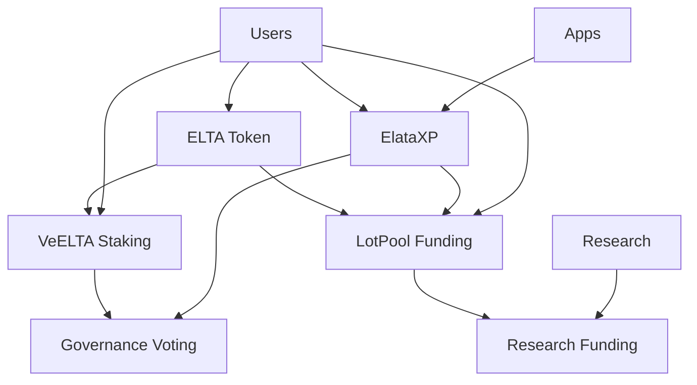
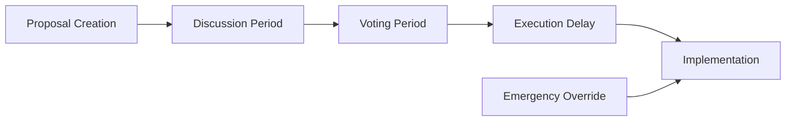

# Elata Protocol Architecture

This document provides a comprehensive overview of the Elata Protocol architecture, including smart contracts, token economics, and governance mechanisms.

## Table of Contents

- [Overview](#overview)
- [Smart Contract Architecture](#smart-contract-architecture)
- [Token Economics](#token-economics)
- [Governance System](#governance-system)
- [Integration Points](#integration-points)
- [Security Model](#security-model)

## Overview

The Elata Protocol is designed as a decentralized ecosystem for precision psychiatry research, consisting of four main layers:

```
┌─────────────────────────────────────────────────────────────┐
│                        App Layer                            │
│  EEG Pong • Meditation Apps • Competitive Platforms       │
└─────────────────────────────────────────────────────────────┘
                                │
┌─────────────────────────────────────────────────────────────┐
│                    Governance Layer                         │
│      ELTA Token • veELTA Staking • XP System • LotPool     │
└─────────────────────────────────────────────────────────────┘
                                │
┌─────────────────────────────────────────────────────────────┐
│                      Data Layer                             │
│        ZORP Protocol • Data Trusts • IPFS Storage          │
└─────────────────────────────────────────────────────────────┘
                                │
┌─────────────────────────────────────────────────────────────┐
│                    Hardware Layer                           │
│       Open-Source EEG Devices • Raspberry Pi • ADS1299    │
└─────────────────────────────────────────────────────────────┘
```

## Smart Contract Architecture

### Core Contracts

#### 1. ELTA Token (`ELTA.sol`)

**Purpose**: Governance and utility token for the Elata ecosystem.

**Key Features**:
- ERC20 standard with Votes, Permit, and Burnable extensions
- 77,000,000 total supply cap
- No transfer fees or taxes
- Role-based minting permissions

**Architecture**:
```solidity
ELTA
├── ERC20 (base functionality)
├── ERC20Burnable (burn mechanism)
├── ERC20Permit (gasless approvals)
├── ERC20Votes (governance voting)
└── AccessControl (role management)
```

**State Variables**:
- `MAX_SUPPLY`: Immutable supply cap
- `MINTER_ROLE`: Role hash for minting permissions

#### 2. Vote-Escrowed ELTA (`VeELTA.sol`)

**Purpose**: Time-locked staking for governance participation.

**Key Features**:
- Linear decay voting power
- 1 week to 2 year lock periods
- Non-transferable positions
- Reentrancy protection

**Voting Power Calculation**:
```
votingPower = lockedAmount × (timeRemaining / MAX_LOCK_DURATION)
```

**State Structure**:
```solidity
struct Lock {
    uint128 amount;    // Locked ELTA amount
    uint64 start;      // Lock start timestamp
    uint64 end;        // Lock end timestamp
}
```

#### 3. Experience Points (`ElataXP.sol`)

**Purpose**: Non-transferable reputation system for ecosystem participation.

**Key Features**:
- Soulbound tokens (non-transferable)
- Checkpoint system for historical balances
- Auto-delegation for voting power
- Role-based minting/burning

**Use Cases**:
- Research funding votes
- App store reputation
- Community governance participation
- Access control for premium features

#### 4. Lot Pool Governance (`LotPool.sol`)

**Purpose**: XP-weighted funding mechanism for research projects.

**Key Features**:
- Weekly funding rounds
- Snapshot-based voting
- Multiple proposal support
- Transparent fund distribution

**Round Lifecycle**:
1. **Start Round**: Admin creates round with proposals and recipients
2. **Voting Period**: Users allocate XP weight across proposals
3. **Finalization**: Admin distributes funds to winning proposal

### Contract Interactions



## Token Economics

### ELTA Token Distribution

| Allocation | Percentage | Amount | Vesting |
|------------|------------|--------|---------|
| Presale | 7.5% | 5.775M | Immediate |
| Community Sale | 10% | 7.7M | Immediate |
| Team & Advisors | 15% | 11.55M | 6-year linear |
| Treasury | 38% | 29.26M | DAO controlled |
| Community Incentives | 20% | 15.4M | Performance based |
| Liquidity | 10% | 7.7M | DEX provision |

### Value Accrual Mechanisms

1. **Governance Rights**: ELTA holders vote on protocol parameters
2. **Staking Rewards**: veELTA stakers receive protocol revenue
3. **Utility Demand**: ELTA required for premium app features
4. **Deflationary Pressure**: Token burning reduces supply

### XP Token Economics

- **Earning Mechanisms**:
  - EEG data submission: 10-100 XP per session
  - App engagement: 1-10 XP per activity
  - Community participation: Variable rewards
  - Research contributions: Bonus multipliers

- **Decay Mechanism** (Future):
  - 14-day rolling window
  - Encourages continuous participation
  - Prevents XP hoarding

## Governance System

### Multi-Layer Governance

#### Layer 1: ELTA Token Governance
- **Scope**: Protocol parameters, treasury management
- **Mechanism**: Token-weighted voting
- **Quorum**: 4% of total supply
- **Timelock**: 48-hour delay for execution

#### Layer 2: veELTA Enhanced Voting
- **Scope**: Strategic decisions, major upgrades
- **Mechanism**: Time-weighted voting power
- **Benefits**: Rewards long-term alignment
- **Maximum Weight**: 2x for maximum lock duration

#### Layer 3: XP-Weighted Research Funding
- **Scope**: Research grant allocation
- **Mechanism**: Expertise-based voting
- **Frequency**: Weekly funding rounds
- **Allocation**: Merit-based distribution

### Governance Process



## Integration Points

### ZORP Protocol Integration

- **Data Submission**: XP rewards for EEG data
- **Privacy Layer**: Zero-knowledge proofs for anonymity
- **Storage**: IPFS/Arweave for decentralized data storage
- **Access Control**: Token-gated data access

### EEG Hardware Integration

- **Device Registration**: NFT-based device authentication
- **Quality Metrics**: Data quality affects XP rewards
- **Calibration**: Automated device calibration protocols
- **Firmware Updates**: Decentralized update mechanism

### App Ecosystem Integration

- **SDK**: Developer tools for app integration
- **Revenue Sharing**: Protocol fee distribution
- **User Authentication**: Token-based identity
- **Leaderboards**: XP-based ranking systems

## Security Model

### Access Control Matrix

| Role | ELTA | VeELTA | ElataXP | LotPool |
|------|------|--------|---------|---------|
| Admin | All permissions | Manager | All permissions | Manager |
| Minter | Mint tokens | - | Award/Revoke XP | - |
| Manager | - | Emergency functions | - | Round management |
| User | Transfer/Vote | Stake/Unstake | Earn XP | Vote in rounds |

### Security Mechanisms

1. **Multi-Signature Administration**:
   - 3-of-5 multisig for admin functions
   - Time-locked critical operations
   - Emergency pause mechanisms

2. **Reentrancy Protection**:
   - OpenZeppelin ReentrancyGuard
   - Checks-Effects-Interactions pattern
   - State validation before external calls

3. **Input Validation**:
   - Custom error messages
   - Boundary condition checks
   - Zero address validation

4. **Upgrade Safety**:
   - Non-upgradeable contracts
   - Immutable core logic
   - Migration-based upgrades

### Risk Mitigation

| Risk | Likelihood | Impact | Mitigation |
|------|------------|--------|------------|
| Smart Contract Bug | Low | High | Comprehensive testing, audits |
| Governance Attack | Medium | Medium | Quorum requirements, timelocks |
| Oracle Manipulation | Low | Medium | Multiple data sources |
| Flash Loan Attack | Low | Low | Lock periods, non-transferable XP |

## Performance Considerations

### Gas Optimization

- **Packed Structs**: Minimize storage slots
- **Batch Operations**: Reduce transaction costs
- **View Functions**: Off-chain data queries
- **Event Indexing**: Efficient data retrieval

### Scalability

- **Layer 2 Ready**: Compatible with Polygon, Arbitrum
- **State Channels**: Off-chain micro-transactions
- **IPFS Storage**: Decentralized file storage
- **Caching Layer**: Redis for frequently accessed data

## Future Enhancements

### Phase 2 Features

- [ ] Multi-lock positions (ve-NFT style)
- [ ] Rewards distributor for stakers
- [ ] Advanced governance (quadratic voting)
- [ ] Cross-chain bridge integration

### Phase 3 Features

- [ ] AI model marketplace
- [ ] Decentralized compute network
- [ ] Privacy-preserving analytics
- [ ] Mobile app ecosystem

---

*This architecture document is living documentation and will be updated as the protocol evolves.*
