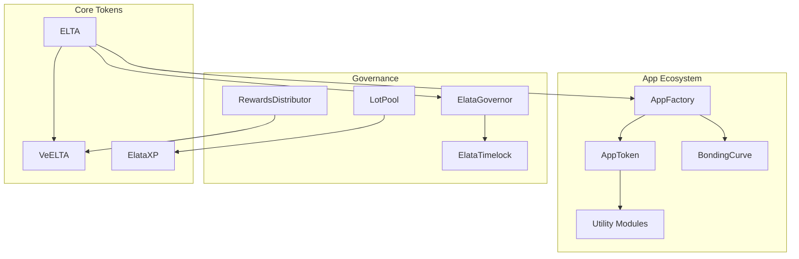
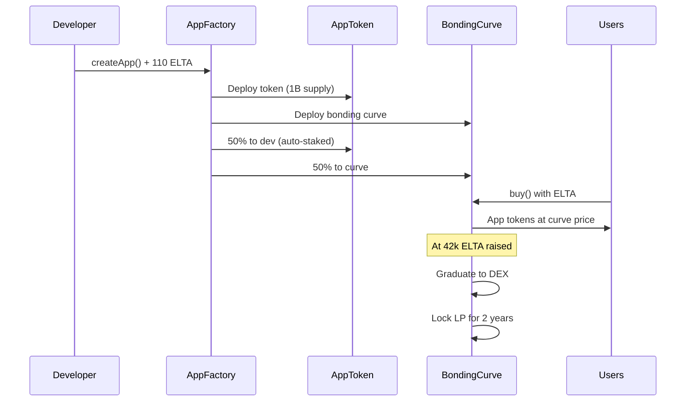
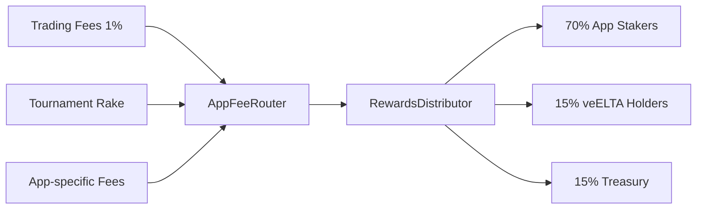

# Architecture Overview

This document explains how the Elata Protocol contracts fit together, the design decisions behind them, and how data flows through the system.

## System Overview

The protocol consists of three layers:

1. **Core Token Layer** — ELTA token, veELTA staking, and XP reputation
2. **Governance Layer** — On-chain voting, timelocks, and funding allocation
3. **App Ecosystem Layer** — Token launches, bonding curves, and utility modules

Each layer builds on the one below it. Apps use the governance layer for funding decisions, and governance uses the token layer for voting power calculations.


```mermaid
graph TB
    subgraph "App Ecosystem"
        AppFactory[AppFactory]
        AppToken[AppToken]
        BondingCurve[BondingCurve]
        Modules[Utility Modules]
    end
    
    subgraph "Governance"
        Governor[ElataGovernor]
        Timelock[ElataTimelock]
        LotPool[LotPool]
        Rewards[RewardsDistributor]
    end
    
    subgraph "Core Tokens"
        ELTA[ELTA]
        VeELTA[VeELTA]
        XP[ElataXP]
    end
    
    AppFactory --> AppToken
    AppFactory --> BondingCurve
    AppToken --> Modules
    
    Governor --> Timelock
    LotPool --> XP
    Rewards --> VeELTA
    
    ELTA --> VeELTA
    ELTA --> Governor
    ELTA --> AppFactory
```

## Core Token Layer

### ELTA Token

ELTA is a standard ERC20 token with governance extensions. It serves as the economic unit for the entire protocol.

**Key properties:**
- 77 million maximum supply (hard cap, enforced in contract)
- ERC20Votes for on-chain governance delegation
- ERC20Permit for gasless approvals
- Burnable for deflationary mechanics
- No transfer fees or taxes

The token uses OpenZeppelin's AccessControl for minting permissions. Only addresses with `MINTER_ROLE` can mint new tokens, and minting always respects the supply cap.

Source: [src/token/ELTA.sol](../src/token/ELTA.sol)

### VeELTA Staking

VeELTA represents locked ELTA with time-weighted voting power. Users lock ELTA for a duration between 7 days and 2 years, receiving veELTA that determines their governance influence and reward share.

**How the boost works:**

Locking for longer gives more veELTA per ELTA locked:
- 7 days (minimum): 1x boost
- 1 year: 1.5x boost
- 2 years (maximum): 2x boost

The formula is linear interpolation:

```
boost = 1 + (duration / MAX_LOCK)
veELTA_minted = ELTA_locked × boost
```

**Lock lifecycle:**

1. User calls `lock(amount, unlockTime)` to create a position
2. veELTA is minted based on amount and duration
3. User can call `increaseAmount()` to add more ELTA
4. User can call `extendLock()` to push out the unlock time
5. After unlock time passes, user calls `unlock()` to retrieve ELTA

The veELTA balance is used for both governance voting and reward distribution snapshots. It's non-transferable to prevent vote buying.

Source: [src/staking/VeELTA.sol](../src/staking/VeELTA.sol)

### ElataXP Reputation

XP tracks user participation and contribution. Unlike ELTA, XP cannot be transferred or traded. It's earned through protocol activity and used to weight votes in funding decisions.

**Distribution methods:**

1. **Direct award** — Operators with `XP_OPERATOR_ROLE` call `award(user, amount)`
2. **Signature-based** — Off-chain operators sign EIP-712 messages that users submit
3. **Merkle claims** — Batch distributions via Merkle tree proofs

XP is permanent by default. Once earned, it stays unless explicitly revoked by an operator. This simplifies accounting and makes reputation predictable.

**Why separate XP from ELTA?**

XP represents *participation* (voice in funding decisions), while ELTA represents *ownership* (economic stake and yield). Keeping them separate prevents users from simply buying reputation. You have to earn XP through actual contribution.

Source: [src/experience/ElataXP.sol](../src/experience/ElataXP.sol)

See also: [xp-system.md](./xp-system.md) for Merkle distribution details.

## Governance Layer

### LotPool Funding Rounds

LotPool runs weekly funding rounds where the community decides how to allocate treasury funds. Votes are weighted by XP, not ELTA, so funding decisions reflect participation rather than capital.

**Round lifecycle:**

1. Admin calls `startRound()` with a list of proposals and their recipient addresses
2. Contract takes an XP snapshot at the current block
3. Users vote by allocating their XP across proposals
4. After the voting period (typically 7 days), admin calls `finalize()`
5. The winning proposal's recipient receives ELTA from the pool

Users can split their XP across multiple proposals. The snapshot ensures nobody can earn XP mid-round to influence the vote.

Source: [src/governance/LotPool.sol](../src/governance/LotPool.sol)

### ElataGovernor

The Governor handles protocol parameter changes and upgrades through on-chain voting. It uses ELTA (via delegation) for voting power.

**Standard proposals:**
- Voting delay: 1 day (time between proposal and voting start)
- Voting period: 7 days
- Proposal threshold: 0.1% of total supply (~77,000 ELTA)
- Quorum: 4% of total supply (~3.08M ELTA)

**Emergency proposals:**
- Proposal threshold: 5% of total supply
- Voting period: 3 days (expedited)

Emergency proposals allow faster response to critical issues while requiring higher threshold to prevent abuse.

The Governor can be connected to ElataTimelock for execution delays, though the initial deployment operates without timelock integration.

Source: [src/governance/ElataGovernor.sol](../src/governance/ElataGovernor.sol)

### RewardsDistributor

The RewardsDistributor collects protocol fees and splits them according to a fixed ratio:

- 70% to app token stakers (proportional to their stake)
- 15% to veELTA holders (proportional to their veELTA)
- 15% to treasury

Revenue sources include trading fees from bonding curves (1%), tournament rake, and app-specific fees. The distributor accepts both ELTA and app tokens, tracking them in separate epochs.

Claims use on-chain snapshots rather than Merkle trees, so users can claim directly without needing off-chain proof generation.

Source: [src/rewards/RewardsDistributor.sol](../src/rewards/RewardsDistributor.sol)

## App Ecosystem Layer

The app ecosystem allows developers to launch their own tokens with built-in economic infrastructure.

### App Launch Flow


```mermaid
sequenceDiagram
    participant Dev as Developer
    participant Factory as AppFactory
    participant Token as AppToken
    participant Curve as BondingCurve
    participant Users
    
    Dev->>Factory: createApp() + 110 ELTA
    Factory->>Token: Deploy token (1B supply)
    Factory->>Curve: Deploy bonding curve
    Factory->>Token: 50% to dev (auto-staked)
    Factory->>Curve: 50% to curve
    
    Users->>Curve: buy() with ELTA
    Curve->>Users: App tokens at curve price
    
    Note over Curve: At 42k ELTA raised
    Curve->>Curve: Graduate to DEX
    Curve->>Curve: Lock LP for 2 years
```

**Step by step:**

1. Developer pays 110 ELTA (100 seed + 10 creation fee)
2. AppFactory deploys an AppToken with 1 billion supply
3. AppFactory deploys a bonding curve for price discovery
4. 50% of tokens go to the developer (auto-staked for alignment)
5. 50% go to the bonding curve for public trading
6. Users buy tokens with ELTA; price rises along the curve
7. When 42,000 ELTA is raised, the curve graduates
8. Graduation creates a DEX liquidity pair and locks it for 2 years

### AppFactory

The factory deploys new app tokens and their bonding curves. It also registers apps in an on-chain registry for discovery.

**XP-gated early access:**

For the first 6 hours after launch, only users with at least 100 XP can buy. This rewards active community members and prevents bot sniping.

Source: [src/apps/AppFactory.sol](../src/apps/AppFactory.sol)

### AppBondingCurve

The bonding curve provides fair price discovery without traditional liquidity provision. Price increases as more tokens are bought, following a predetermined curve.

A 1% trading fee on each buy/sell routes to the RewardsDistributor. After graduation, all trading happens on the DEX instead.

Source: [src/apps/AppBondingCurve.sol](../src/apps/AppBondingCurve.sol)

### Utility Modules

After launching a token, developers can add utility modules:

| Module | Purpose | Source |
|--------|---------|--------|
| AppStakingVault | Per-app token staking | [AppStakingVault.sol](../src/apps/AppStakingVault.sol) |
| AppAccess1155 | NFT items and access passes | [AppAccess1155.sol](../src/apps/AppAccess1155.sol) |
| EpochRewards | Time-boxed reward distribution | [src/apps/EpochRewards.sol](../src/apps/) |
| Tournament | Competitive events with prizes | [Tournament.sol](../src/apps/Tournament.sol) |

Modules are deployed via AppModuleFactory and configured by the app developer.

Source: [src/apps/AppModuleFactory.sol](../src/apps/AppModuleFactory.sol)

## Fee Flow


```mermaid
graph LR
    Trading[Trading Fees 1%] --> Router[AppFeeRouter]
    Tournament[Tournament Rake] --> Router
    AppFees[App-specific Fees] --> Router
    
    Router --> Distributor[RewardsDistributor]
    
    Distributor --> AppStakers[70% App Stakers]
    Distributor --> VeELTA[15% veELTA Holders]
    Distributor --> Treasury[15% Treasury]
```

All protocol fees flow through AppFeeRouter to RewardsDistributor. This ensures consistent distribution regardless of the fee source.

## Design Decisions

### Why non-upgradeable contracts?

Upgradeable contracts (proxies) add complexity and trust assumptions. By making contracts immutable:
- Users can verify the code they're interacting with
- No admin can change contract logic after deployment
- Security audits remain valid indefinitely

The tradeoff is that bugs cannot be fixed in place. We mitigate this with thorough testing and the ability to deploy new versions that users can migrate to.

### Why separate governance tokens?

The protocol uses three different tokens for different purposes:
- **ELTA** for economic ownership and protocol governance
- **veELTA** for time-weighted voting power
- **XP** for participation-weighted funding decisions

This separation prevents plutocracy (money buying all influence) while still rewarding economic stakeholders.

### Why time-locked staking?

Time-locking ELTA into veELTA:
- Prevents flash loan governance attacks
- Aligns voters with long-term protocol health
- Creates predictable token supply dynamics

### Why bonding curves for app launches?

Bonding curves provide:
- Fair price discovery without market makers
- Transparent, deterministic pricing
- Protection against rug pulls (LP is locked on graduation)
- Equal opportunity for all buyers (no insider allocations)

## Contract Dependencies

```
ELTA
├── VeELTA (locks ELTA)
├── ElataGovernor (uses ELTA for voting)
└── AppFactory (accepts ELTA for app creation)

ElataXP
└── LotPool (uses XP for funding votes)

VeELTA
└── RewardsDistributor (uses veELTA for reward claims)

AppToken
├── AppBondingCurve (handles trading)
├── AppStakingVault (handles staking)
└── AppAccess1155 (handles item purchases)
```

## Gas Costs

Typical operation costs on Ethereum mainnet (at 20 gwei):

| Operation | Gas | Cost |
|-----------|-----|------|
| ELTA transfer | 56k | $2.20 |
| Create staking lock | 88k | $3.50 |
| Vote in funding round | 86k | $3.40 |
| Claim rewards | 80k | $3.20 |
| Create app | 7.2M | $288 |

App creation is expensive due to deploying multiple contracts. On L2s like Base, these costs are 50-100x lower.
