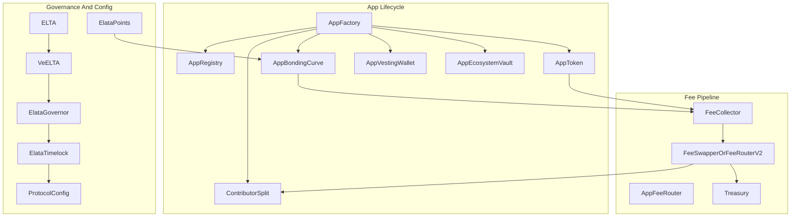

# Architecture Overview

This document describes the current contract architecture and value flow in the repository.

## System Topology

```mermaid
graph TB
    subgraph appLifecycle [App Lifecycle]
        AppFactory[AppFactory]
        AppRegistry[AppRegistry]
        AppToken[AppToken]
        AppCurve[AppBondingCurve]
        Vesting[AppVestingWallet]
        Ecosystem[AppEcosystemVault]
        Split[ContributorSplit]
    end

    subgraph feePipeline [Fee Pipeline]
        AppFeeRouter[AppFeeRouter]
        FeeCollector[FeeCollector]
        FeeSwapper[FeeSwapperOrFeeRouterV2]
        Treasury[Treasury]
    end

    subgraph governanceLayer [Governance And Config]
        ELTA[ELTA]
        VeELTA[VeELTA]
        XP[ElataPoints]
        Gov[ElataGovernor]
        Timelock[ElataTimelock]
        Config[ProtocolConfig]
    end

    AppFactory --> AppRegistry
    AppFactory --> AppToken
    AppFactory --> AppCurve
    AppFactory --> Vesting
    AppFactory --> Ecosystem
    AppFactory --> Split

    AppCurve --> FeeCollector
    AppToken --> FeeCollector
    FeeCollector --> FeeSwapper
    FeeSwapper --> Treasury
    FeeSwapper --> Split

    ELTA --> VeELTA
    VeELTA --> Gov
    Gov --> Timelock
    Timelock --> Config
    XP --> AppCurve
```

## Core Components

### ELTA

- Contract: `ELTA`
- Supply model: fixed `77,000,000` minted once at deployment
- Purpose: quote asset for launches/curve trading and governance ecosystem base asset

### VeELTA

- Contract: `VeELTA`
- Lock range: `7` to `730` days
- Boost: linear `1x -> 2x`
- Transferability: non-transferable (soulbound behavior)

### ElataPoints (XP)

- Contract: `ElataPoints`
- Purpose in launch flow: early-buy gating in `AppBondingCurve`
- Default gate: `100 XP` for the first `6 hours`

## App Launch Lifecycle

### Phase A: App Registration

`AppFactory.createAppWithoutToken(...)`:

1. Collects launch fee (`10 ELTA` by default).
2. Deploys per-app `ContributorSplit`.
3. Registers app in `AppRegistry` with owner safe and split.

### Phase B: Token Launch

`AppFactory.launchTokenForApp(...)`:

1. Collects seed ELTA (`100 ELTA` default).
2. Deploys `AppToken`, `AppBondingCurve`, `AppStakingVault`, `AppVestingWallet`, `AppEcosystemVault`.
3. Mints fixed app supply (`10,000,000`) as:
   - `50%` curve
   - `25%` vesting
   - `25%` ecosystem
4. Initializes curve reserves and ownership/roles.

### Curve Lifecycle

`AppBondingCurve` states:

- `PENDING`
- `ACTIVE`
- `GRADUATED`
- `CANCELLED`

Rules:

- Curve activates after `activationDelay`.
- Graduation at `reserveElta >= targetRaisedElta` (default `42,000 ELTA`).
- Forced graduation available after `deadline`.
- On graduation, Uniswap V2 LP is created and LP is locked (`730 days` default).

## Fee Pipeline (Current)

### Sources

- Launch fee (`LAUNCH_FEE`)
- Bonding-curve trade fee (`TRADING_FEE`)
- LP-keyed transfer tax (`TRANSFER_TAX`)
- Content/tournament/other module fees

### Accounting

`FeeCollector` tracks pending balances by:

- `appId`
- `FeeKind`
- `asset`

Sweeps are permissionless and scoped (no global loops).

### Final Routing

`FeeSwapper` (`IFeeRouterV2` alias) enforces routing policy:

- `LAUNCH_FEE` -> `100%` treasury
- App revenue kinds -> contributor split + treasury (default treasury take `20%`, app override supported)
- Paused apps -> `100%` treasury

## AppToken Transfer Tax Semantics

Tax applies only when:

- neither side is exempt, and
- transfer touches an allowlisted LP (`isLiquidityPool[from] || isLiquidityPool[to]`)

Tax does not apply to:

- wallet-to-wallet transfers
- mints/burns
- exempt addresses

## Governance + Configuration

- `ElataGovernor` + `ElataTimelock` govern critical protocol changes.
- `ProtocolConfig` bounds and stores major parameters (fee bps, targets, durations, routing controls).
- Sensitive updates are timelock-gated where configured.

## Security-Oriented Design Notes

- Explicit lifecycle states for curves reduce ambiguous state transitions.
- Fee kinds are explicit enums (`FeeKind`) to avoid accidental routing semantics.
- Per-app sweep and routing avoids unbounded loops in critical paths.
- LP lock on graduation enforces post-curve liquidity commitment.
