# Elata Protocol Architecture

## 🏗️ **System Architecture Overview**


## 📊 **Contract Interaction Matrix**


## 🔄 **State Transitions**

### VeELTA Position Lifecycle


### XP Decay State Machine


### Funding Round State Flow


## 📐 **Mathematical Models**

### Voting Power Decay Function

```mermaid
graph LR
    subgraph "Linear Decay Model"
        INPUT[Lock: 1000 ELTA<br/>Duration: 104 weeks]
        FORMULA[f(t) = 1000 × (104-t)/208]
        OUTPUT[Voting Power over Time]
    end
    
    INPUT --> FORMULA --> OUTPUT
```

**Mathematical Expression:**
$$
VP(t) = A \times \frac{\max(0, D - t)}{MAX\_LOCK}
$$

Where:
- $VP(t)$ = Voting power at time $t$
- $A$ = Locked amount
- $D$ = Lock duration
- $t$ = Time elapsed since lock creation
- $MAX\_LOCK$ = 208 weeks

### XP Decay Function

```mermaid
graph LR
    subgraph "Exponential-like Decay"
        XP_INPUT[XP Entry: 1000 XP<br/>Timestamp: t₀]
        XP_FORMULA[g(t) = 1000 × max(0, (14d - age)/14d)]
        XP_OUTPUT[Effective XP over Time]
    end
    
    XP_INPUT --> XP_FORMULA --> XP_OUTPUT
```

**Mathematical Expression:**
$$
XP_{effective}(t) = \sum_{i=1}^{n} XP_i \times \frac{\max(0, DECAY\_WINDOW - (t - t_i))}{DECAY\_WINDOW}
$$

Where:
- $XP_{effective}(t)$ = Total effective XP at time $t$
- $XP_i$ = Amount of XP entry $i$
- $t_i$ = Timestamp of XP entry $i$
- $DECAY\_WINDOW$ = 14 days

### Reward Distribution Formula

$$
R_u = \frac{VP_u}{\sum_{i=1}^{n} VP_i} \times R_{total}
$$

Where:
- $R_u$ = Reward for user $u$
- $VP_u$ = User's voting power at epoch snapshot
- $R_{total}$ = Total epoch rewards

## 🔗 **Integration Patterns**

### Frontend Data Flow


### Cross-Contract Communication


## 🛡️ **Security Model Deep Dive**

### Access Control Matrix

```mermaid
graph TD
    subgraph "Role Hierarchy"
        ADMIN[DEFAULT_ADMIN_ROLE<br/>🔑 Master Control]
        MINTER[MINTER_ROLE<br/>🏭 Token Creation]
        MANAGER[MANAGER_ROLE<br/>⚙️ Operations]
        DISTRIBUTOR[DISTRIBUTOR_ROLE<br/>💰 Rewards]
        KEEPER[KEEPER_ROLE<br/>🤖 Automation]
        PAUSER[PAUSER_ROLE<br/>⏸️ Emergency Stop]
        EMERGENCY[EMERGENCY_ROLE<br/>🚨 Critical Actions]
    end
    
    ADMIN --> MINTER
    ADMIN --> MANAGER
    ADMIN --> DISTRIBUTOR
    ADMIN --> KEEPER
    ADMIN --> PAUSER
    ADMIN --> EMERGENCY
    
    style ADMIN fill:#ff9999
    style EMERGENCY fill:#ffcdd2
```



### Security Layers


### Attack Vector Mitigation

```mermaid
graph TD
    subgraph "Flash Loan Attacks"
        FA1[Attacker borrows large ELTA amount]
        FA2[Tries to create governance positions]
        FA3[❌ BLOCKED: Time-locked staking required]
    end
    
    subgraph "Voting Manipulation"
        VM1[Attacker tries to buy XP/votes]
        VM2[Attempts to transfer reputation]
        VM3[❌ BLOCKED: Non-transferable XP]
    end
    
    subgraph "Supply Manipulation"
        SM1[Attacker tries to mint unlimited tokens]
        SM2[Attempts to exceed supply cap]
        SM3[❌ BLOCKED: Hard cap enforcement]
    end
    
    subgraph "Governance Takeover"
        GT1[Attacker accumulates voting power]
        GT2[Tries to pass malicious proposals]
        GT3[❌ BLOCKED: Quorum + timelock delays]
    end
    
    style FA3 fill:#c8e6c9
    style VM3 fill:#c8e6c9
    style SM3 fill:#c8e6c9
    style GT3 fill:#c8e6c9
```



## 💰 **Economic Mechanism Design**

### Token Value Accrual Model


### Staking Incentive Alignment


## 🎮 **User Journey Flows**

### New User Onboarding


### Researcher Journey


### Developer Integration Journey


## 🔄 **Data Flow Diagrams**

### Complete Protocol Data Flow

```mermaid
flowchart TD
    subgraph "User Actions"
        UA1[Play EEG Games]
        UA2[Submit Data]
        UA3[Stake ELTA]
        UA4[Vote in Rounds]
    end
    
    subgraph "Smart Contract Layer"
        SC1[ElataXP.award()]
        SC2[VeELTA.createLock()]
        SC3[LotPool.vote()]
        SC4[RewardsDistributor.claim()]
    end
    
    subgraph "State Changes"
        ST1[XP Balance Updated]
        ST2[NFT Position Minted]
        ST3[Vote Recorded]
        ST4[Rewards Claimed]
    end
    
    subgraph "Events Emitted"
        EV1[XPAwarded]
        EV2[LockCreated]
        EV3[Voted]
        EV4[RewardClaimed]
    end
    
    subgraph "Frontend Updates"
        FE1[Update XP Display]
        FE2[Show New Position]
        FE3[Update Vote Status]
        FE4[Show Claimed Rewards]
    end
    
    UA1 --> SC1 --> ST1 --> EV1 --> FE1
    UA3 --> SC2 --> ST2 --> EV2 --> FE2
    UA4 --> SC3 --> ST3 --> EV3 --> FE3
    UA4 --> SC4 --> ST4 --> EV4 --> FE4
    
    style SC1 fill:#e8f5e8
    style SC2 fill:#e3f2fd
    style SC3 fill:#f3e5f5
    style SC4 fill:#fff3e0
```

## 🎯 **Performance Analysis**

### Gas Cost Breakdown


### Operation Cost Comparison


## 🔮 **Future Architecture**

### Planned Integrations

```mermaid
graph TB
    subgraph "Current Protocol"
        CURRENT[Elata Protocol v2.0<br/>Complete Implementation]
    end
    
    subgraph "Phase 3: Ecosystem Integration"
        ZORP_INT[ZORP Integration<br/>Data submission rewards]
        EEG_INT[EEG Hardware<br/>Direct device integration]
        APP_STORE[App Ecosystem<br/>Revenue sharing]
        DATA_MARKET[Data Marketplace<br/>Monetization]
    end
    
    subgraph "Phase 4: Advanced Features"
        CROSS_CHAIN[Cross-chain Bridge<br/>Multi-network support]
        ZK_PRIVACY[ZK Privacy<br/>Anonymous participation]
        AI_MODELS[AI Marketplace<br/>Model monetization]
        MOBILE_SDK[Mobile SDK<br/>Native app integration]
    end
    
    CURRENT --> ZORP_INT
    CURRENT --> EEG_INT
    CURRENT --> APP_STORE
    CURRENT --> DATA_MARKET
    
    ZORP_INT --> CROSS_CHAIN
    EEG_INT --> ZK_PRIVACY
    APP_STORE --> AI_MODELS
    DATA_MARKET --> MOBILE_SDK
    
    style CURRENT fill:#4caf50
    style ZORP_INT fill:#2196f3
    style CROSS_CHAIN fill:#9c27b0
```

---

## 📚 **Documentation Map**

```mermaid
graph TD
    subgraph "User Documentation"
        UD1[README.md<br/>📖 Overview & Quick Start]
        UD2[CONTRIBUTING.md<br/>👥 Developer Guide]
        UD3[FAQ.md<br/>❓ Common Questions]
    end
    
    subgraph "Technical Documentation"
        TD1[ARCHITECTURE.md<br/>🏗️ System Design]
        TD2[DEPLOYMENT.md<br/>🚀 Deployment Guide]
        TD3[FRONTEND_INTEGRATION.md<br/>🖥️ API Reference]
    end
    
    subgraph "Reference Documentation"
        RD1[Contract ABIs<br/>📋 Interface Specs]
        RD2[Gas Reports<br/>⛽ Cost Analysis]
        RD3[Test Coverage<br/>🧪 Quality Metrics]
    end
    
    UD1 --> TD1
    UD2 --> TD2
    UD3 --> TD3
    
    TD1 --> RD1
    TD2 --> RD2
    TD3 --> RD3
    
    style UD1 fill:#e8f5e8
    style TD1 fill:#e3f2fd
    style RD1 fill:#fff3e0
```

---

*This architecture represents a complete, production-ready DeFi protocol designed specifically for neuroscience research coordination and community governance.*

