# 🚀 Deployment Guide

## 📋 **Deployment Flow Overview**

```mermaid
graph TD
    subgraph "Pre-deployment Phase"
        P1[Environment Setup<br/>🔧 Configure variables]
        P2[Security Review<br/>🛡️ Audit contracts]
        P3[Test Validation<br/>🧪 100% pass rate]
        P4[Gas Estimation<br/>⛽ Cost planning]
    end
    
    subgraph "Deployment Phase"
        D1[Testnet Deploy<br/>🧪 Sepolia validation]
        D2[Community Testing<br/>👥 User validation]
        D3[Final Review<br/>📋 Last checks]
        D4[Mainnet Deploy<br/>🚀 Production launch]
    end
    
    subgraph "Post-deployment Phase"
        PD1[Verification<br/>✅ Contract validation]
        PD2[Configuration<br/>⚙️ Role setup]
        PD3[Monitoring<br/>📊 System health]
        PD4[Community Launch<br/>🎉 Go live]
    end
    
    P1 --> P2 --> P3 --> P4
    P4 --> D1 --> D2 --> D3 --> D4
    D4 --> PD1 --> PD2 --> PD3 --> PD4
    
    style P3 fill:#e8f5e8
    style D4 fill:#fff3e0
    style PD4 fill:#e3f2fd
```



## 🔧 **Environment Configuration**

### Network Setup Matrix


### Deployment Prerequisites


## 📦 **Deployment Process**

### Contract Deployment Sequence

```mermaid
sequenceDiagram
    participant Deployer
    participant ELTA
    participant ElataXP
    participant VeELTA
    participant LotPool
    participant RewardsDistributor
    participant ElataGovernor
    participant Verification
    
    Note over Deployer, Verification: Phase 1: Core Contracts
    Deployer->>ELTA: Deploy with initial mint
    ELTA-->>Deployer: Contract address
    
    Deployer->>ElataXP: Deploy with admin
    ElataXP-->>Deployer: Contract address
    
    Deployer->>VeELTA: Deploy with ELTA reference
    VeELTA-->>Deployer: Contract address
    
    Note over Deployer, Verification: Phase 2: Governance
    Deployer->>LotPool: Deploy with ELTA + XP
    LotPool-->>Deployer: Contract address
    
    Deployer->>RewardsDistributor: Deploy with VeELTA
    RewardsDistributor-->>Deployer: Contract address
    
    Deployer->>ElataGovernor: Deploy with ELTA
    ElataGovernor-->>Deployer: Contract address
    
    Note over Deployer, Verification: Phase 3: Configuration
    Deployer->>RewardsDistributor: addRewardToken(ELTA)
    Deployer->>ElataXP: grantRole(XP_MINTER, LotPool)
    
    Note over Deployer, Verification: Phase 4: Verification
    Deployer->>Verification: Run verification script
    Verification-->>Deployer: All contracts verified ✅
```



### Gas Cost Estimation

```mermaid
graph TD
    subgraph "Deployment Costs by Network"
        direction TB
        
        ETH[Ethereum Mainnet<br/>13M gas × 20 gwei = $260]
        BASE[Base Mainnet<br/>13M gas × 0.05 gwei = $1.30]
        SEPOLIA[Sepolia Testnet<br/>13M gas × 0 gwei = FREE]
    end
    
    subgraph "Cost Breakdown"
        direction TB
        
        C1[ELTA: 2.3M gas (18%)]
        C2[VeELTA: 3.3M gas (25%)]
        C3[ElataXP: 3.0M gas (23%)]
        C4[Others: 4.4M gas (34%)]
    end
    
    style ETH fill:#ff9999
    style BASE fill:#99ccff
    style SEPOLIA fill:#99ff99
```

## ✅ **Verification Procedures**

### Post-Deployment Verification


### Verification Commands

```bash
# Contract verification
cast call $ELTA_ADDRESS "name()" --rpc-url $RPC_URL
cast call $ELTA_ADDRESS "totalSupply()" --rpc-url $RPC_URL
cast call $ELTA_ADDRESS "MAX_SUPPLY()" --rpc-url $RPC_URL

# Access control verification
cast call $ELTA_ADDRESS "hasRole(bytes32,address)" \
  0x0000000000000000000000000000000000000000000000000000000000000000 \
  $ADMIN_MSIG --rpc-url $RPC_URL

# Integration verification
cast call $VEELTA_ADDRESS "ELTA()" --rpc-url $RPC_URL
cast call $LOTPOOL_ADDRESS "XP()" --rpc-url $RPC_URL
```

## 🚨 **Emergency Procedures**

### Incident Response Flow


### Emergency Contact Tree


## 📊 **Monitoring & Analytics**

### Key Performance Indicators

```mermaid
graph TD
    subgraph "Protocol Health"
        PH1[Total Value Locked<br/>📈 Growth metric]
        PH2[Active Users<br/>👥 Engagement]
        PH3[Transaction Volume<br/>💱 Usage]
        PH4[Governance Participation<br/>🗳️ Decentralization]
    end
    
    subgraph "Economic Metrics"
        EM1[Token Price<br/>💰 Market value]
        EM2[Staking Ratio<br/>🔒 Supply locked]
        EM3[XP Distribution<br/>🏅 Participation]
        EM4[Funding Efficiency<br/>💧 Capital allocation]
    end
    
    subgraph "Security Metrics"
        SM1[Failed Transactions<br/>🚨 Error rate]
        SM2[Unusual Patterns<br/>🔍 Anomaly detection]
        SM3[Emergency Usage<br/>⚠️ Crisis indicators]
        SM4[Access Control Events<br/>🔐 Permission changes]
    end
    
    PH1 --> EM1
    PH2 --> EM2
    PH3 --> EM3
    PH4 --> EM4
    
    EM1 --> SM1
    EM2 --> SM2
    EM3 --> SM3
    EM4 --> SM4
    
    style PH1 fill:#e8f5e8
    style EM1 fill:#fff3e0
    style SM1 fill:#ffebee
```



---

*Complete deployment guide with visual workflows for professional protocol deployment.*

