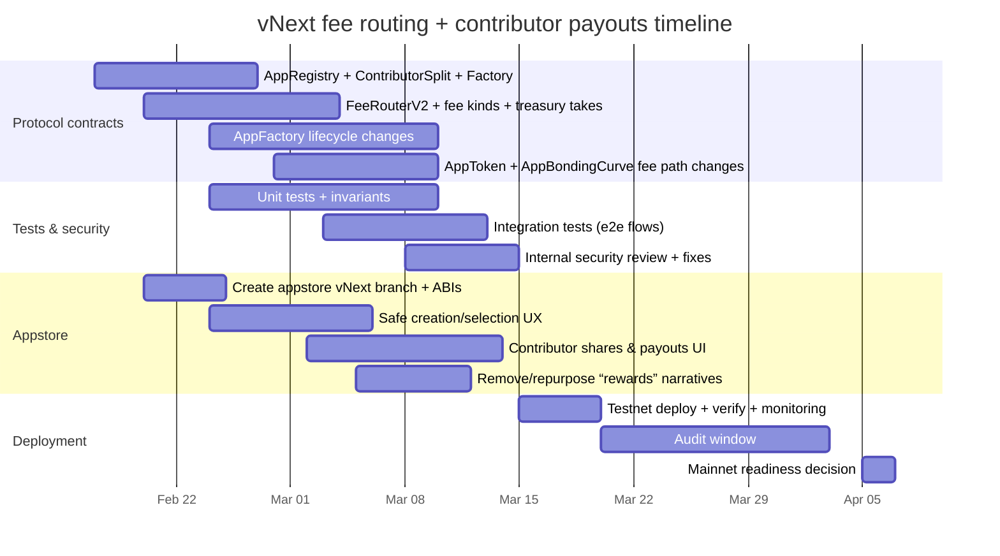

# vNext Fee Routing and Contributor Payout Redesign to Reduce Howey Risk

## Executive summary

This report reviews the **vNext** branch of the protocol repository and the current state of the appstore repository (its **vNext branch is not present**); it then proposes a concrete on-chain and UI design to accomplish the explicit product goal: **reliably paying app teams** while **removing token-holder “fee yields” that create high Howey (securities) exposure** under U.S. federal law. fileciteturn136file0L1-L1 fileciteturn150file0L1-L1 citeturn8search1turn7search2turn11search43turn12search48

The highest-risk element in the current vNext design is the explicit routing of protocol/app fees to **app-token stakers** and **veELTA lockers**; this closely tracks patterns the entity["organization","U.S. Securities and Exchange Commission","us federal securities regulator"] has repeatedly treated as investment-contract risk factors in digital-asset enforcement (expectation of profit; reliance on managerial/entrepreneurial efforts; and sale-as-fundraising). fileciteturn138file0L1-L1 fileciteturn139file0L1-L1 citeturn7search2turn11search43turn12search48turn12search1turn12search2

The core proposed change is straightforward and minimal in spirit: **stop paying token holders**; instead, operationalize “fairness” through **compensation analogs**, by paying only a bounded set of **identified contributors** (team members) via a **shares-based ContributorSplit** controlled by an app-controlled multisig (a Safe). “Access tokens” may still exist, but they do not carry dividend-like or fee-like entitlements; any “value” comes from access, discounts, gating, reputation, and coordination rights rather than cashflow rights. citeturn7search2turn12search48turn8search1turn10search2turn12search0

Because there is no statutory “bright-line” safe harbor for “≤200 wallets,” a contributor cap should be treated as an **operational and narrative support** (it looks like a team cap, not a public profit program), not as legal magic; the main mitigation is that recipients are paid **because they work**, not because they bought/held a token. citeturn8search1turn7search2turn12search48turn10search4

Finally, the proposed architecture explicitly supports: **app-without-token launches**, **launch-token-later** flows, treasury-first protocol fee routing, and front-end integration points to create and operate app safes (including weekly pull-based claims and multisig execution). fileciteturn136file0L1-L1 fileciteturn153file0L1-L1 citeturn14search5turn13search10turn13search0turn13search6

## Information needs and sources reviewed

To answer rigorously, I had to learn:

1. How vNext currently routes protocol fees and app fees; and which contracts implement the routing and payout logic. fileciteturn138file0L1-L1 fileciteturn139file0L1-L1 fileciteturn151file0L1-L1  
2. How apps are launched on vNext; what is deployed (token, curve, vaults); and how launch parameters and tokenomics are encoded. fileciteturn136file0L1-L1 fileciteturn140file0L1-L1  
3. How “staking” and “rewards” are represented for ELTA/veELTA (and for app tokens); because this is the securities hinge. fileciteturn147file0L1-L1 fileciteturn138file0L1-L1  
4. What the appstore UI currently assumes about token supply, staking rewards, and app creation; because migration must update the UI contract surface and UX narratives. fileciteturn132file0L1-L1 fileciteturn154file0L1-L1 fileciteturn153file0L1-L1  
5. Current U.S. federal securities posture as to staking and revenue-like token yields; and how major cases and SEC staff statements frame the Howey factors for crypto. citeturn8search1turn7search2turn11search43turn12search48turn10search2turn7search0turn7search6  

Enabled connectors: **github** (used first, as requested).

Repositories examined:

- **Elata-Biosciences/elata-protocol**, branch **vNext** (present). fileciteturn136file0L1-L1  
- **Elata-Biosciences/elata-appstore**, branch **vNext** (**not found**; analysis uses `main` solely to identify current UI assumptions and required changes). fileciteturn153file0L1-L1  

Requested file inventory: found vs unspecified

- Found in `elata-protocol` vNext (reviewed): `README.md`, `docs/TOKENOMICS.md`, `docs/PROTOCOL_SUMMARY.md`, `docs/ARCHITECTURE.md`, `src/apps/AppFactory.sol`, `src/apps/AppBondingCurve.sol`, `src/apps/AppToken.sol`, `src/rewards/RewardsDistributor.sol`, `src/rewards/AppRewardsDistributor.sol`, `src/fees/AppFeeRouter.sol`, `src/staking/VeELTA.sol`, `src/governance/ElataGovernor.sol`, `src/governance/ElataTimelock.sol`. fileciteturn136file0L1-L1 fileciteturn140file0L1-L1 fileciteturn150file0L1-L1 fileciteturn138file0L1-L1 fileciteturn139file0L1-L1 fileciteturn151file0L1-L1 fileciteturn147file0L1-L1 fileciteturn148file0L1-L1 fileciteturn149file0L1-L1  
- Present in vNext but not in the default-branch indexed results of the GitHub connector search (still reviewed via direct branch fetch): `src/fees/FeeCollector.sol`, `src/fees/FeeManager.sol`, `src/fees/FeeSwapper.sol`. (These files materially affect fee routing in vNext; they should be treated as authoritative for vNext despite being absent from the connector’s default-branch index.)  
- Unspecified in-repo: the **ELTA token contract source**. Multiple docs refer to a `lib/ELTA/src/ELTA.sol` path, but the file was not retrievable in-branch via the connector; therefore ELTA’s precise on-chain implementation details are **unspecified within these repos** and must be validated separately before launch (e.g., via the actual deployed bytecode or the true source repository). fileciteturn135file2L1-L1  

Primary legal sources emphasized: Howey; SEC FinHub framework; SEC DAO report; SEC Munchee order; court decisions and docket PDFs; plus 2025 SEC staff statements on protocol staking and liquid staking. citeturn8search1turn7search2turn11search43turn12search48turn10search2turn7search0turn7search6  

## Current vNext inventory and key gaps

### Fee routing and payout as implemented

The current protocol design contains **two overlapping fee-routing narratives**:

- A “classic” flow where a global router forwards fees into a distributor that applies a fixed split (70/15/15); the architecture docs and contracts emphasize this. fileciteturn151file0L1-L1 fileciteturn138file0L1-L1 fileciteturn135file2L1-L1  
- A “newer” design direction (present on vNext) around per-app accounting, sweepable balances, and swap-to-stablecoin treasury handling (FeeCollector/FeeManager/FeeSwapper), but not yet consistently reflected in the docs or UI; there are also integration gaps (e.g., app-token transfer-tax accounting).  

In the **AppFeeRouter** contract, the bonding curve can “take and forward” an ELTA fee directly to a distributor; the router is governance-configurable and capped (5%). fileciteturn151file0L1-L1  
In the **RewardsDistributor** contract, deposits are explicitly split among (i) app-staker rewards, (ii) veELTA “epoch” rewards, and (iii) treasury; the contract design uses snapshots and per-user cursors for claims. fileciteturn138file0L1-L1  

In the **AppRewardsDistributor**, the app-staker portion is then distributed across registered vaults based on vault totalSupply snapshots; users claim pro-rata based on historical votes. fileciteturn139file0L1-L1  

In the **AppToken** implementation, a configurable transfer fee (LP-keyed tax) exists; when a FeeCollector is configured, fees route to it; otherwise a legacy split routes tokens directly to app rewards, global rewards, and treasury addresses. fileciteturn150file0L1-L1  

From a securities-risk perspective, the essential observation is simple: **“buy/hold/stake token → receive a share of protocol/app fees”** is the most direct token-structure analogue to dividends or revenue participation; it tends to satisfy the prongs of Howey that the SEC, courts, and staff have emphasized in crypto enforcement and guidance. citeturn8search1turn7search2turn11search43turn12search48turn12search1turn12search2  

### App launch and token issuance behavior

The vNext **AppFactory** is a “deploy everything” factory: it deploys an app token, a bonding curve and surrounding components, assigns roles, and registers the app; it includes a seed amount and creation fee paid in ELTA. fileciteturn136file0L1-L1  

The vNext **AppBondingCurve** manages buy/sell pricing and state transitions, and includes XP-gated early access. fileciteturn140file0L1-L1  

The appstore UI (main branch) still hardcodes and displays assumptions like “1B total supply” and “stake to earn fees,” which do not align cleanly with the current vNext factory implementation and the desired legal direction. fileciteturn132file0L1-L1 fileciteturn154file0L1-L1 citeturn5search2  

### ELTA/veELTA and governance

veELTA (“vote-escrowed ELTA”) is implemented as a non-transferable ERC20Votes-like instrument with a lock duration range (min 7 days; max 2 years) and boost (1x to 2x); it explicitly supports governance snapshots and reward share calculations. fileciteturn147file0L1-L1  

On-chain governance exists through an OpenZeppelin Governor + timelock pattern, with emergency proposal handling described in the governor contract and a timelock contract defining standard delays. fileciteturn148file0L1-L1 fileciteturn149file0L1-L1  

### Gaps relative to the stated product need

The feature you explicitly need—**“pay the people who actually run/build the app”** reliably and transparently without token-balance revenue sharing—is **not first-class** in vNext:

- There is no **ContributorRegistry** concept; there is no on-chain “team list” with weights.  
- There is no **ContributorSplit** payout primitive (a PaymentSplitter-like contract or equivalent).  
- There is no **AppRegistry** that treats “app without token” as a first-class object with a stable appId and owner safe.  
- Fee routing does not currently distinguish cleanly between: **protocol fees** (must go to treasury) vs **app revenue** (should go to the app’s contributors after protocol take).  
- The appstore UI currently frames veELTA locking as a way to “earn protocol fee rewards,” which is a materially risky narrative under Howey even if the mechanics shift. fileciteturn154file0L1-L1 citeturn8search1turn7search2turn12search48turn11search43  

## Proposed on-chain design

### Design principles and constraints

The guiding constraints, stated operationally:

- **Protocol fees** (bonding curve trading fees; app-token transfer tax; app launch fees) route to the **Elata treasury**; no token-holder participation in those cashflows.  
- **App revenue** (content sales, tournament rake, in-app module fees) can be split: protocol take to treasury, remainder to **contributors of that app**.  
- “App tokens” are **access/utility** tokens; they do not carry fee yield, dividends, buybacks, or claims on protocol treasury. This directly targets the “expectation of profit” and “efforts of others” Howey prongs. citeturn8search1turn7search2turn12search48turn10search2  
- Contributor payouts should look and behave like “team compensation plumbing,” not “passive yield”; recipients are explicitly enumerated addresses controlled by humans/teams.  
- A “200 wallet” cap should be treated as a representational device (a bounded team) rather than a legal threshold; there is no SEC rule that “201 makes it a security.” citeturn8search1turn7search2turn12search48turn10search4  
- All payout distribution should be **pull-based** to avoid unbounded loops; OpenZeppelin’s PaymentSplitter pattern is a proven precedent. citeturn13search2turn13search6  

### Core contracts

This proposal introduces four core protocol-level contracts, plus small changes to existing ones:

- `AppRegistry` (new): canonical on-chain registry of appId → ownerSafe → (optional) token/curve → contributorSplit → metadata.  
- `ContributorRegistry` (new): canonical on-chain registry of appId → contributors → shares (with cap); can either be integrated into ContributorSplit, or referenced by it; I recommend integrating it into the split contract to avoid TOCTOU state bugs.  
- `ContributorSplit` (new; per-app): a PaymentSplitter-like contract, but upgradeable only by the app owner safe; supports shares updates (unlike standard OZ PaymentSplitter which is immutable once deployed). Pull-claims; no loops.  
- `FeeRouterV2` (new): single routing surface for fees with explicit `FeeKind`; routes protocol fees 100% to treasury; routes app revenue to treasury + contributorSplit.

To keep creation gas manageable in a system where factories already deploy multiple contracts, deploy per-app ContributorSplits as EIP-1167 minimal clones. citeturn13search0turn13search5  

### Safe integration as owner-of-record

Each app should be controlled by a multisig smart account; this report assumes a Safe deployment pattern.

The Safe design is attractive because it provides:

- A mature, audited multisig execution model; a natural place for team governance.  
- A clean mapping to “contributors are added/updated by the team,” without exposing the protocol to arbitrary update threat surfaces.

Safe proxies are designed for cheap deployment by delegating to a singleton contract; Safe docs describe the proxy and factory mechanics and show `createProxyWithNonce` flows. citeturn13search10turn14search5turn14search6  

Operationally: the appstore front-end creates a Safe (or lets the user select an existing Safe); the Safe address is passed into `AppFactory`/`AppRegistry` as the `ownerSafe`. The Safe UI can always “see” the Safe by importing the address; Safe’s own support docs describe verifying Safe creation and canonical factories. citeturn14search2turn14search0  

### Solidity-style interfaces and events

Below are Solidity-style **interfaces and event signatures** sufficient to implement and index the new model. The interfaces are structured so they can be pasted into vNext as part of a PR description and then implemented to match the repo’s style.

```solidity
// SPDX-License-Identifier: MIT
pragma solidity ^0.8.24;

enum FeeKind {
    PROTOCOL_LAUNCH_FEE,      // app creation fee, paid in ELTA; 100% treasury
    PROTOCOL_TRADING_FEE,     // bonding curve trading fee, paid in ELTA; 100% treasury
    PROTOCOL_TRANSFER_TAX,    // app token LP-keyed transfer tax; swapped then 100% treasury
    APP_REVENUE_CONTENT,      // content module revenue; treasury take + contributor split
    APP_REVENUE_TOURNAMENT,   // tournament rake; treasury take + contributor split
    APP_REVENUE_OTHER         // extensibility
}

interface IAppRegistry {
    struct AppInfo {
        address ownerSafe;         // Safe smart account as owner-of-record
        address contributorSplit;  // per-app split contract
        address appToken;          // optional; zero if not launched
        address bondingCurve;      // optional; zero if not launched
        string  metadataURI;       // ipfs/arweave/https; appstore chooses
        bool    tokenLaunched;
        bool    paused;            // governance emergency kill-switch
    }

    event AppRegistered(
        uint256 indexed appId,
        address indexed ownerSafe,
        address indexed contributorSplit,
        string metadataURI
    );

    event AppOwnerUpdated(uint256 indexed appId, address indexed oldOwnerSafe, address indexed newOwnerSafe);
    event AppMetadataURIUpdated(uint256 indexed appId, string oldURI, string newURI);

    event AppTokenLaunched(
        uint256 indexed appId,
        address indexed appToken,
        address indexed bondingCurve
    );

    event AppPaused(uint256 indexed appId, bool paused);

    function getApp(uint256 appId) external view returns (AppInfo memory);

    function ownerSafeOf(uint256 appId) external view returns (address);
    function contributorSplitOf(uint256 appId) external view returns (address);

    // Only governance/timelock
    function setPaused(uint256 appId, bool paused) external;

    // Only app ownerSafe (executed via Safe)
    function setOwnerSafe(uint256 appId, address newOwnerSafe) external;
    function setMetadataURI(uint256 appId, string calldata newURI) external;

    // Only AppFactory
    function setTokenAndCurve(uint256 appId, address appToken, address bondingCurve) external;
}

interface IContributorSplit {
    struct Contributor {
        address account;
        uint64  shares; // units; sum == TOTAL_SHARES
    }

    event ContributorSet(
        uint256 indexed appId,
        address indexed account,
        uint64 shares
    );

    event ContributorsReconfigured(uint256 indexed appId, uint256 contributorCount);

    event PaymentReceived(
        uint256 indexed appId,
        FeeKind indexed kind,
        address indexed asset,
        uint256 amount,
        address from
    );

    event PaymentReleased(
        uint256 indexed appId,
        address indexed asset,
        address indexed to,
        uint256 amount
    );

    event TreasuryTakeUpdated(uint256 indexed appId, uint16 oldBps, uint16 newBps);

    function appId() external view returns (uint256);
    function ownerSafe() external view returns (address);

    function contributorCount() external view returns (uint256);
    function maxContributors() external view returns (uint256);
    function sharesOf(address account) external view returns (uint64);
    function totalShares() external view returns (uint64);

    // App team management; callable only by ownerSafe (i.e., Safe execTransaction)
    function setContributors(Contributor[] calldata contributors) external;

    // Pull payouts
    function releasable(address asset, address account) external view returns (uint256);
    function release(address asset, address account) external;

    // Router entrypoint; callable only by FeeRouterV2
    function onFeeReceived(FeeKind kind, address asset, uint256 amount, address from) external;
}

interface IFeeRouterV2 {
    event FeeAccrued(uint256 indexed appId, FeeKind indexed kind, address indexed asset, uint256 amount, address payer);
    event FeeRoutedToTreasury(uint256 indexed appId, FeeKind indexed kind, address indexed asset, uint256 amount);
    event FeeRoutedToContributors(
        uint256 indexed appId,
        FeeKind indexed kind,
        address indexed asset,
        uint256 contributorsAmount,
        address contributorSplit
    );

    event SwapPerformed(uint256 indexed appId, address indexed tokenIn, uint256 amountIn, address indexed tokenOut, uint256 amountOut);

    function accrue(uint256 appId, FeeKind kind, address asset, uint256 amount, address payer) external;
    function sweep(uint256 appId, FeeKind kind, address asset) external;
}
```

### How FeeRouterV2 should behave

FeeRouterV2 is the “single throat to choke” for both accounting and risk control; it should implement:

- **Explicit fee-kind gating**: protocol fee kinds always route 100% to treasury; app revenue kinds route by a per-app or global `treasuryTakeBps` (e.g., 500 = 5%).  
- **Asset-agnostic receipt**: the router can receive ELTA, USDC, or app tokens; if app tokens are received as protocol transfer tax, it swaps to ELTA or USDC and then routes to treasury.  
- **Pull-based contributor payouts**: FeeRouterV2 deposits the contributor portion into the ContributorSplit, not directly to members. This ensures no loops and no gas bombs. citeturn13search6turn13search2  

### AppFactory changes to support “app without token” and “launch token later”

vNext AppFactory currently assumes tokens are created at app creation and registers token/vault relationships. fileciteturn136file0L1-L1  

Proposed change: split the lifecycle into two distinct phases.

Phase A: Register app (no token)

- Create `appId`; create ContributorSplit; register app metadata; set ownerSafe.
- Allow immediate deployment of non-token modules (e.g., content NFTs) that pay app revenue fees into FeeRouterV2 and ContributorSplit.

Phase B: Launch token (optional)

- Only the app ownerSafe can launch a token later; it deploys AppToken and AppBondingCurve, sets token roles to the Safe, and registers token/curve in AppRegistry.  
- The same `appId` is retained; the token becomes an attribute of the app rather than the app’s identity.

This supports your explicit requirement: “launch apps without tokens; launch one later.” It also supports the legal risk direction: it becomes natural to treat app tokens as optional “access overlays,” not as the fundamental economic claim. citeturn12search48turn7search2turn10search2  

### Contributor cap and “who can passively claim revenue”

Mechanically: only addresses listed as contributors in ContributorSplit can claim; the contract enforces `contributorCount <= maxContributors`.

Legally: the goal is that **no one can passively claim revenue merely by holding a token**; to claim app-revenue fees, you must be explicitly designated as a contributor by the app team safe (and thus plausibly provide “efforts” rather than investment capital). This targets Howey’s “expectation of profit from efforts of others” prong. citeturn8search1turn7search2turn12search48turn10search4  

A cap like 150 (Dunbar) or 200 can be product-justified as “team scale”; it is not a legal safe harbor, but it does help the system resemble “compensation plumbing” rather than “public yield program.” citeturn8search1turn7search2turn12search48  

## Migration plan, code changes, and deployment steps

### Strategy overview

Because vNext is still a branch, you can implement these changes **prior to any production deployment**; that is the best-case scenario. If any deployments have already occurred, the plan becomes “deploy new contracts; deprecate old fee paths; migrate UI and indexing,” because immutability prevents in-place edits. fileciteturn148file0L1-L1 citeturn11search43  

### Step-by-step technical plan

Protocol repository changes (elata-protocol vNext)

1. Add new contracts:
   - `src/registry/AppRegistry.sol`
   - `src/contributors/ContributorSplit.sol` (+ `ContributorSplitFactory.sol` using EIP-1167 clones)
   - `src/fees/FeeRouterV2.sol` (with explicit FeeKind)
2. Modify `AppFactory`:
   - Add `createAppWithoutToken(...)` returning `appId` + addresses; register in AppRegistry; deploy ContributorSplit via factory; set ownerSafe to Safe address.  
   - Add `launchTokenForApp(appId, tokenParams, curveParams)` callable only by ownerSafe; deploy token and curve; register.  
   - Update legacy `createApp(...)` to either call both steps or to remain a convenience wrapper.
3. Modify `AppBondingCurve`:
   - Remove fee forwarding into RewardsDistributor / AppRewardsDistributor; instead route trading fees explicitly as `FeeKind.PROTOCOL_TRADING_FEE` to FeeRouterV2 (or accrue into FeeCollector then sweep). fileciteturn140file0L1-L1  
4. Modify `AppToken`:
   - Remove legacy 70/15/15 split used when `feeCollector` is unset; insist on a single path routing protocol transfer taxes to FeeRouterV2 as `FeeKind.PROTOCOL_TRANSFER_TAX`. fileciteturn150file0L1-L1  
   - Ensure the tax accounting is correct (avoid “transfer-to-collector without incrementing pending balances” patterns).
5. Deprecate or remove:
   - `RewardsDistributor` and `AppRewardsDistributor` as active payout routes (the code may remain for research branches, but the protocol should not route fees there). fileciteturn138file0L1-L1 fileciteturn139file0L1-L1  
6. Update governance control points:
   - AppRegistry `pauseApp(appId)` callable only by Governor/Timelock; use for emergency freezes. fileciteturn148file0L1-L1 fileciteturn149file0L1-L1  

Appstore repository changes (elata-appstore)

1. Create a **vNext branch** (required; currently absent) to match protocol vNext deployment targets; update all contract ABIs and address mapping. fileciteturn153file0L1-L1  
2. Update `src/lib/contracts.ts` to include:
   - `APP_REGISTRY`, `FEE_ROUTER_V2`, `CONTRIBUTOR_SPLIT_FACTORY` (and/or split ABI). fileciteturn153file0L1-L1  
3. Launch wizard changes:
   - Add a “Create or Select Team Safe” step before “Review & Launch” (and pass Safe address into AppFactory).  
   - Add “Contributor Shares” step that initializes ContributorSplit; show as a pie chart; the transaction is executed by the Safe.  
   - Add toggle: “Launch without token (recommended)” vs “Launch token now.”  
   - Fix tokenomics numbers displayed; current UI shows fixed 1B supply and fee-yield framing. fileciteturn132file0L1-L1  
4. Rewards UI:
   - Replace “Lock ELTA … earn protocol fee rewards” with governance-only language (participate in governance; reputation; access gating) unless protocol staking is truly in-scope; the current wording is a material risk signal. fileciteturn154file0L1-L1 citeturn7search2turn12search48  
5. Add “Payouts” UI page:
   - For app contributors: show accrued balances by asset; weekly claim buttons; claim is a direct call to ContributorSplit `release`.  
   - For app teams: Safe-only transaction builder for updating shares and adding/removing contributors.

Testing and audit steps

- Extend Foundry tests:
  - Fee routing invariants: protocol fee kinds always end in treasury; app revenue kinds split deterministically; no route reaches token holders.  
  - ContributorSplit invariants: shares sum; maxContributors enforced; release math correct for ERC20; reentrancy protections.  
  - App lifecycle tests: create app without token; launch token later; ensure mappings and permissions.  
- Run at least one bespoke audit pass focusing on: access control (Safe-only); fee-kind spoofing; swap slippage; and griefing (anyone calling `sweep`).  
- Consider formal verification or rule-based checking for payout math (PaymentSplitter-like math is historically error-prone). citeturn13search6turn13search2  

### File-to-change mapping with risk and effort

| Current vNext file / area | Current role | Proposed change | Risk (eng) | Effort |
|---|---|---|---|---|
| `src/rewards/RewardsDistributor.sol` | Routes fees to stakers/veELTA/treasury | Remove from fee path; no yield distributions | High | Med |
| `src/rewards/AppRewardsDistributor.sol` | App-staker fee distribution | Remove from fee path | High | Med |
| `src/fees/AppFeeRouter.sol` | Fee pull + forward to distributor | Replace with `FeeRouterV2` and explicit `FeeKind` | Med | Med |
| `src/apps/AppBondingCurve.sol` | App token trading + trading fees | Route trading fees as protocol fees → treasury (FeeRouterV2) | Med | Med |
| `src/apps/AppToken.sol` | LP-keyed transfer tax; legacy fee split | Route transfer tax only to treasury; delete legacy split | High | Med |
| `src/apps/AppFactory.sol` | Deploy app + token + curve | Split lifecycle; add app-without-token + launch-token-later; Safe owner | Med | High |
| `src/staking/VeELTA.sol` | Locking for votes; currently used for rewards | Keep for governance; remove revenue-yield narratives | Low | Low |
| `src/governance/*` | Governor + timelock | Add pause hooks for AppRegistry | Low | Low |
| `elata-appstore/src/lib/contracts.ts` | ABIs and addresses | Add AppRegistry/FeeRouterV2/Split ABIs | Low | Low |
| `elata-appstore/launch wizard` | Calls `createApp`; displays tokenomics | Add Safe step, shares step, no-token flow | Med | High |
| `elata-appstore/rewards/page.tsx` | veELTA “earn protocol fees” | Rename/repurpose to governance; remove “earn fees” framing | Med | Med |

(Protocol file roles for AppFactory, AppBondingCurve, RewardsDistributor, and AppToken are derived from their contract-level designs and docstrings.) fileciteturn136file0L1-L1 fileciteturn140file0L1-L1 fileciteturn138file0L1-L1 fileciteturn150file0L1-L1  

## Securities and security risk analysis under Howey

### Howey framework as applied to token-fee structures

Under **Howey**, an “investment contract” exists when there is (i) an investment of money (ii) in a common enterprise (iii) with a reasonable expectation of profits (iv) derived from the efforts of others. citeturn8search1turn8search0  

SEC staff guidance for digital assets (FinHub framework) emphasizes practical indicators: fundraising use of proceeds; reliance on an “active participant”; marketing that suggests token price appreciation; and economic rights that resemble revenue share. citeturn7search2turn7search8  

The SEC’s **DAO Report** and **Munchee** order are especially relevant: they show that tokens can be treated as securities even if there is claimed “utility,” where the economic reality and promotion communicate profit expectations from managerial efforts. citeturn11search43turn12search48turn12search0turn11search0  

The court outcomes in **Kik** and **Telegram** illustrate that token distributions framed and executed as capital-raising schemes, with buyers expecting issuer-driven appreciation and secondary-market trading, have been treated as securities offerings. citeturn10search4turn12search1turn12search2turn8search3  

The **Ripple** summary judgment decision underscores that courts may distinguish transaction types (institutional sales vs programmatic trading-platform sales vs service-compensation distributions), and that “other distributions” as compensation for services were not treated as investment contracts in that case’s analysis; however, this does not create a general safe harbor for “access tokens.” citeturn10search2turn9news46turn9search1  

### How current vNext features map to Howey risk

The table below isolates the features you asked about and maps them to the Howey factors most implicated.

| Feature (current vNext) | Howey factor pressure | Risk level | Why |
|---|---|---|---|
| App-token staking rewards (fees to app stakers via AppRewardsDistributor) | Expectation of profit; efforts of others | High | Looks like a dividend or revenue share for holders; core profit-expectation trigger. fileciteturn139file0L1-L1 citeturn7search2turn12search48turn10search4 |
| veELTA fee rewards (epochs; claim pro-rata) | Expectation of profit; common enterprise | High | “Lock token → earn fee share” is economically a yield product; risk remains even if styled as governance. fileciteturn147file0L1-L1 fileciteturn138file0L1-L1 citeturn8search1turn7search2turn12search48 |
| Bonding curve token sales with trading fees | Investment of money; expectation of profit | Medium–High | Buyers pay value for tokens; if the marketing narrative is price-up and fee yields, risk rises; if purely access and no issuer promises, risk lowers but is not zero. fileciteturn140file0L1-L1 citeturn7search2turn12search48turn10search2 |
| Transfer-tax on app tokens | Expectation of profit (if redistributed) | Medium–High | A “tax” that funds rewards increases investment-like framing; a tax routed only to treasury is administratively cleaner but still must avoid buyback/dividend narratives. fileciteturn150file0L1-L1 citeturn7search2turn11search43 |
| FeeRouter → RewardsDistributor fixed split | Efforts of others | High | Central distribution logic looks like an issuer-managed yield engine. fileciteturn151file0L1-L1 fileciteturn138file0L1-L1 |
| AppFactory launch fee mechanics | Investment of money (by devs) | Low–Medium | A flat fee is not itself a token offering; but if framed as “invest to earn,” risk rises; keep it as payment for services. fileciteturn136file0L1-L1 |

### How the proposed changes mitigate Howey

The proposed ContributorSplit architecture is not a “zero-risk guarantee,” but it improves posture on the two prongs that repeatedly drive outcomes:

- **Expectation of profit**: token holders no longer have any contractual or protocol-embedded entitlement to share in fees; that removes the most obvious dividend analogue. citeturn8search1turn7search2turn12search48  
- **Efforts of others**: recipients of app-revenue payouts are enumerated contributors and thus can be framed as being paid for their own efforts; this resembles compensation rather than passive return. The distinction is consistent with how courts examined “other distributions” and issuer communications in Ripple and Kik. citeturn10search2turn10search4turn7search2  

Two legal cautions are crucial:

- “Calling it guild fees” is not the fix; **economic reality controls**. The SEC and courts repeatedly say terminology and technology do not defeat securities substance. citeturn11search0turn11search43turn12search48turn8search1  
- A “4-year stake to get payouts” does not automatically help; long lockups can actually strengthen “investment” framing. The better move is what you already gravitated toward: **remove staking-as-a-payout-gate entirely** for fee distributions, unless the staking is truly protocol-security staking of a covered PoS network asset (a very different scenario). citeturn7search0turn7search3turn7search2turn8search1  

### Enforcement posture notes relevant to design choice

The SEC’s Division of Corporation Finance issued a May 29, 2025 staff statement suggesting that certain protocol-staking activities tied to validating PoS networks are not securities transactions; there was also an August 5, 2025 staff statement on certain liquid staking activities. These statements are fact-specific and explicitly framed as staff views rather than binding Commission rules; Commissioner statements also show internal disagreement. citeturn7search0turn7search6turn7search3turn7search2  

Those staking statements do **not** provide strong comfort for a “stake our token to earn our app/protocol fees” design; the staff statements are about protocol consensus staking, not general revenue-sharing tokenomics. citeturn7search0turn7search2turn7search3  

## UX flows, operational model, and implementation timeline

### User and team flows

App creation flow (front-end)

1. **Create or select a Safe** (team multisig). Use Safe’s standard proxy deployment patterns; ensure you can verify the creation via a canonical factory/mastercopy. citeturn14search5turn14search2turn13search10  
2. **Register app** via `createAppWithoutToken`: appId assigned; ContributorSplit deployed; metadata stored; app appears in AppRegistry.  
3. **Set contributor shares** in a dedicated UI step. The UI prepares a `setContributors()` call; submission is a Safe transaction requiring threshold signatures.  
4. **Optional: launch token now** (or later). If “launch later,” the app is live in the store with non-token modules; if “launch now,” AppFactory deploys the token and curve and registers them.

Contributor payout flow (weekly pull)

- FeeRouterV2 continuously accrues app revenue and deposits contributor portions into the app’s ContributorSplit.  
- Contributors visit the “Payouts” page and call `release(asset, me)` weekly (or whenever they choose). This avoids protocol loops and is consistent with payment-splitting best practice. citeturn13search6turn13search2  

Multisig execution options

- Default: the app Safe directly updates contributors and shares (fast; lower attack surface).  
- Optional governance overlay: DAO proposal queues updates into a timelock that calls `AppRegistry.pauseApp` or performs emergency actions; do not require DAO involvement for routine team payroll-like changes, unless you want governance overhead. fileciteturn148file0L1-L1 fileciteturn149file0L1-L1  

### Diagrams

Fee routing flow (proposed)

```mermaid
flowchart LR
  subgraph Sources
    BC[AppBondingCurve\n(PROTOCOL_TRADING_FEE)]
    AT[AppToken\n(PROTOCOL_TRANSFER_TAX)]
    CS[Content/Tournament Modules\n(APP_REVENUE_*)]
  end

  subgraph Routing
    FR[FeeRouterV2\n(accrue + sweep)]
    AS[AppRegistry\n(appId → contributorSplit)]
    SPLIT[ContributorSplit\n(pull claims)]
    TREAS[Treasury\n(USDC/ELTA)]
  end

  BC --> FR
  AT --> FR
  CS --> FR

  FR -->|protocol fees 100%| TREAS
  FR -->|app revenue: takeBps| TREAS
  FR -->|app revenue remainder| SPLIT
  FR --> AS
```

Contributor payout flow (proposed)

```mermaid
flowchart TB
  TEAM[App Team Safe] -->|execTransaction| SET[setContributors\n(shares)]
  FR[FeeRouterV2] -->|deposit| SPLIT[ContributorSplit]

  SPLIT -->|release(asset, me)| C1[Contributor A]
  SPLIT -->|release(asset, me)| C2[Contributor B]
  SPLIT -->|release(asset, me)| Cn[Contributor N]

  GOV[DAO Governor/Timelock] -->|pauseApp / emergency| REG[AppRegistry]
```

### UI mockups and integration images

image_group{"layout":"carousel","aspect_ratio":"16:9","query":["Safe wallet transaction queue screenshot","Safe wallet owners threshold settings screenshot","multisig pie chart allocation UI example","web3 payout dashboard claim rewards UI"],"num_per_query":1}

### Implementation checklist

Contract layer

- Implement `AppRegistry`, `ContributorSplit(+Factory)`, and `FeeRouterV2`. citeturn13search0turn13search6turn13search10  
- Update AppFactory to support no-token and token-later lifecycle; enforce Safe ownership. fileciteturn136file0L1-L1  
- Update AppToken and AppBondingCurve to route protocol fees only to treasury via FeeRouterV2; delete legacy yield routing. fileciteturn150file0L1-L1 fileciteturn140file0L1-L1  
- Add governance pause hooks in AppRegistry via Governor+Timelock. fileciteturn148file0L1-L1 fileciteturn149file0L1-L1  

Testing and review

- Unit tests: payout correctness; shares sum; cap enforced; access control; fee-kind routing invariants.  
- Integration tests: end-to-end “create app without token → deploy content module → accrue revenue → contributor claims.”  
- Dedicated review: “fee kind spoofing” and “swaps” (slippage, router allowlist), plus reentrancy.  

Frontend and ops

- Create `vNext` branch on appstore; update contracts map; add Safe creation/selection step; add contributor shares UI; update narratives and remove “earn protocol fees” language. fileciteturn153file0L1-L1 fileciteturn154file0L1-L1  
- Update backend app indexing to handle apps without tokens; the docs describe appstore API endpoints and data model expectations. citeturn4search4  

### Suggested timeline



## Primary sources consulted

Protocol design and UI sources (GitHub)

- `src/apps/AppFactory.sol` fileciteturn136file0L1-L1  
- `src/apps/AppBondingCurve.sol` fileciteturn140file0L1-L1  
- `src/apps/AppToken.sol` fileciteturn150file0L1-L1  
- `src/rewards/RewardsDistributor.sol` fileciteturn138file0L1-L1  
- `src/rewards/AppRewardsDistributor.sol` fileciteturn139file0L1-L1  
- `src/fees/AppFeeRouter.sol` fileciteturn151file0L1-L1  
- `src/staking/VeELTA.sol` fileciteturn147file0L1-L1  
- `src/governance/ElataGovernor.sol` and `src/governance/ElataTimelock.sol` fileciteturn148file0L1-L1 fileciteturn149file0L1-L1  
- Appstore contract surface and UX assumptions: `src/lib/contracts.ts`, launch wizard step, rewards page fileciteturn153file0L1-L1 fileciteturn132file0L1-L1 fileciteturn154file0L1-L1  

Primary U.S. securities law and SEC materials

- Howey test: 328 U.S. 293 (1946) (Cornell LII; Justia Supreme Court Center) citeturn8search1turn8search0  
- SEC FinHub framework and statement on the framework citeturn7search2turn7search8  
- SEC DAO report (Release No. 81207) and press release citeturn11search43turn11search0  
- SEC Munchee order (Release No. 10445) and press release citeturn12search48turn12search0  
- SEC press releases on Kik and Telegram settlements citeturn12search1turn12search2  
- Ripple docket PDF (ECF 874) via Justia; plus related orders citeturn10search2turn10search1  
- SEC 2025 staff statements on protocol staking and liquid staking (plus commissioner response illustrating non-unanimity) citeturn7search0turn7search6turn7search3  

Safe and payout implementation precedents

- Safe proxy deployment docs and examples citeturn13search10turn14search5turn14search6turn14search2  
- OpenZeppelin PaymentSplitter pull-payment model citeturn13search2turn13search6  
- EIP-1167 minimal proxy (clones) citeturn13search0turn13search5